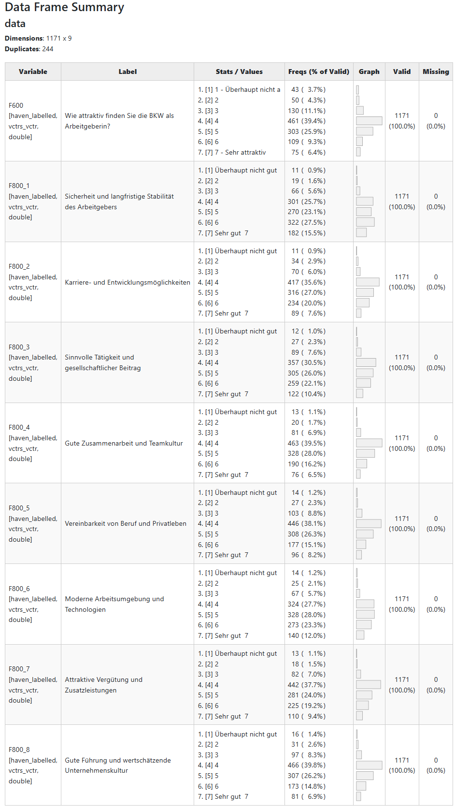

<!-- README.md is generated from README.Rmd. Please edit that file -->

```{r, include = FALSE}
knitr::opts_chunk$set(
  collapse = TRUE,
  comment = "#>",
  fig.path = "man/figures/README-",
  out.width = "100%"
)
```

# YouAnalyser <a href="https://eguizarrosales.github.io/YouAnalyser/"></a>


<!-- badges: start -->
<!-- badges: end -->

The goal of YouAnalyser is to provide Analytics Partners of YouGov DACH with a convenient and standardized way to perform core analyses on survey data, such as Key Driver Analysis (KDA). The package includes functions for data preprocessing, exploratory data analysis (EDA), and KDA (more to come), all designed to work seamlessly with survey data in the `haven::labelled()` format. By using YouAnalyser, you can save time and ensure consistency in your analyses across different projects.

## Installation and Setup

You can install the development version of YouAnalyser from [GitHub](https://github.com/) with:

``` r
# install.packages("pak")
pak::pak("EGuizarRosales/YouAnalyser")
```

Then, in your scripts, use:

```{r load-libraries}
library(YouAnalyser)
library(haven)
```

**Some general Tips:**

* You can find the documentation for each function by calling `?function_name` in your R console (e.g., `?eda_summary`).
* This package is documented with vignettes. You can browse the available vignettes with `browseVignettes("YouAnalyser")` and open a specific vignette with `vignette("vignette_name", package = "YouAnalyser")`.
* The most convenient way to access the full documentation of this package is through the website: <https://eguizarrosales.github.io/YouAnalyser/>.

## 1. Data Processing, Convenience Functions, and Example Data

All data processing functions start with the prefix `dp_`, while convenience functions start with the prefix `ya_`. For a detailed walkthrough of the data processing functions, please refer to the vignette included in the package (use e.g. `vignette("dp", package = "YouAnalyser")`), which provide step-by-step guides on how to use the various functions for data processing and other convenient tasks.

`YouAnalyser` assumes that your data comes in the `haven::labelled()` format, which is common for survey data. The package includes functions to help you process and prepare your data for analysis if your data is not already in this format:

* `dp_copy_codebook_template()`: Copy a codebook template to a specified file path
* `dp_convert_to_labelled()`: Convert a data frame to a labelled data frame using a codebook.
* `dp_inspect_codebook()`: Inspect the codebook of a labelled data frame (useful to check whether labelling worked as expected)

The convenience functions starting with `ya_` mostly take care of selecting files, defining file names, and saving plots:

* `ya_choose_file()`: Choose an existing file and return its path
* `ya_choose_file_path()`: Choose an existing directory and define a new file in this directory, returning the full file path
* `ya_save_plot()`: Save a plot to JPEG

Special consideration should be given to `ya_setup_folder_structure()`, which creates a standardized folder structure for your project. This function is designed to help you organize your files and outputs in a consistent way across different projects. By default, it creates the following folder structure:

```{r folder-structure, eval = FALSE}
├── 01_input
│   └── data
│       ├── processed
│       └── raw
├── 02_scripts
├── 03_output
│   ├── data
│   ├── plots
│   └── reports
├── Project2.Rproj
└── R
```

The `ya_setup_folder_structure()` function is used in workflows. See `vignette("kda", package = "YouAnalyser")` for an example of how to use it in a workflow.

## 2. Exploratory Data Analysis (EDA)

All EDA functions start with the prefix `eda_`. For a detailed walkthrough of the EDA functions, please refer to the vignettes included in the package (use e.g. `vignette("eda", package = "YouAnalyser")`), which provide step-by-step guides on how to use the various functions for EDA.

There are two basic functions for EDA in the YouAnalyser package: `eda_summary()` and `eda_correlation()`. The former provides a summary of the data, including descriptive statistics and missing values, while the latter calculates and visualizes correlations between variables.

```{r eda_summary-example}
eda_summary(
  data = bkw_processed,
  variables = c("F600", paste0("F800_", 1:8)),
  console_output = TRUE,
  browser_output = FALSE
)
```

By setting `browser_output = TRUE`, the output will be displayed in your default web browser, which can be more convenient for exploring large tables and visualizations. The result will look like this:



You can request a correlation matrix for a set of variables using the `eda_correlation()` function:

```{r eda_correlation-example, fig.width = 12, fig.height = 12, out.width = "100%"}
eda_corrs <- eda_correlation(
  data = bkw_processed,
  variables = c("F600", paste0("F800_", 1:8)),
  correlation_type = "Pearson"
)
print(eda_corrs$d)
print(eda_corrs$p)
```

There are many more options for `correlation_type`. To see all available options, call `?correlation::correlation` and read the details section.

## 3. Key Driver Analysis (KDA)

All KDA functions start with the prefix `kda_`. For a detailed walkthrough of the KDA functions, please refer to the vignettes included in the package (use e.g. `vignette("kda", package = "YouAnalyser")`), which provide step-by-step guides on how to use the various functions for KDA.

This is a basic example which shows you how to conduct a End-2-End Key Driver Analysis using the YouAnalyser package. For a more detailed walkthrough, please refer to the vignettes included in the package (use e.g. `vignette("kda", package = "YouAnalyser")`), which provide step-by-step guides on how to use the various functions for KDA.

```{r kda_regression_example}
res <- kda_regression(
  data = bkw_processed,
  outcome = "F600",
  predictors = paste0("F800_", 1:8),
  diagnostics = TRUE,
  importance_method = "auto"
)
```

`res` is a list containing the results of the KDA, including the fitted regression model, variable importance and performance measures, and plots. The most important outcome is the "Importance Performance Map Analysis" (IPMA) plot, which can be accessed like this:

```{r res_plots_ipma_p, fig.width = 12, fig.height = 10, out.width = "100%", eval = FALSE}
res$plots$ipma_scatterPlot$p
```

Below you can find all the available plots in the `res` object. You can save these plots using the `ya_save_plot()` function, which allows you to specify the file path and dimensions of the saved plot.
```{r save_available_kda_plots, include = FALSE, eval = FALSE}
purrr::iwalk(
  .x = res$plots,
  .f = \(x, name) {
    ya_save_plot(
      plot = x$p,
      file_path = paste0(
        "./man/figures/",
        name,
        ".jpeg"
      ),
      width = 30,
      height = 20,
      verbose = FALSE
    )
  }
)
```

`res$plots$diagnostics_correlation`


`res$plots$diagnostics_model`


`res$plots$model_forestPlot$p`


`res$plots$importance_barPlot$p`


`res$plots$performance_barPlot$p`


`res$plots$ipma_scatterPlot$p`


