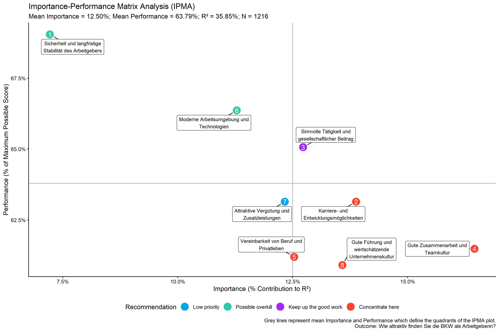
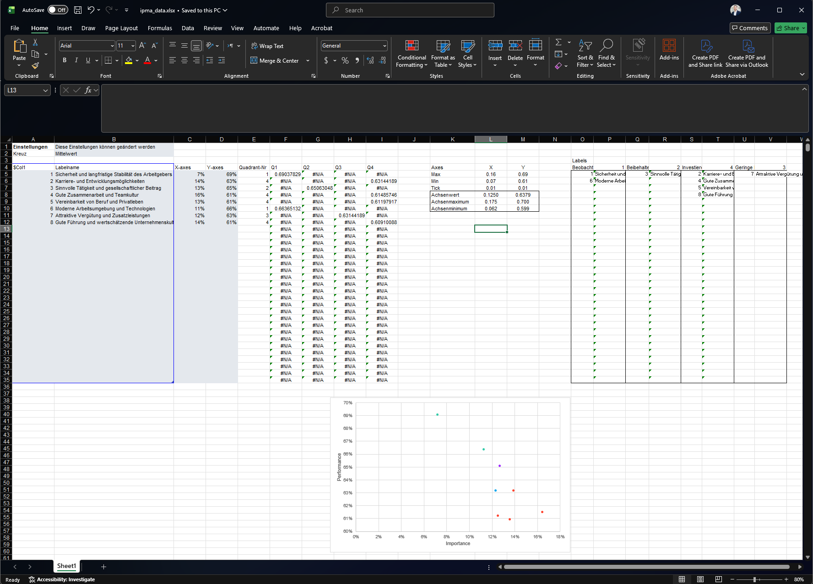
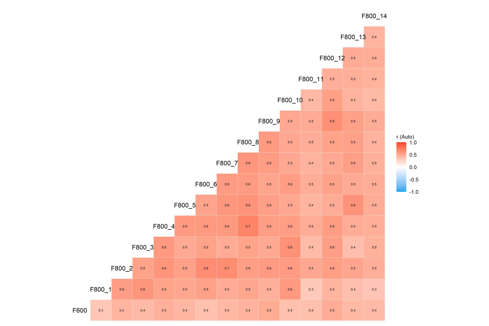
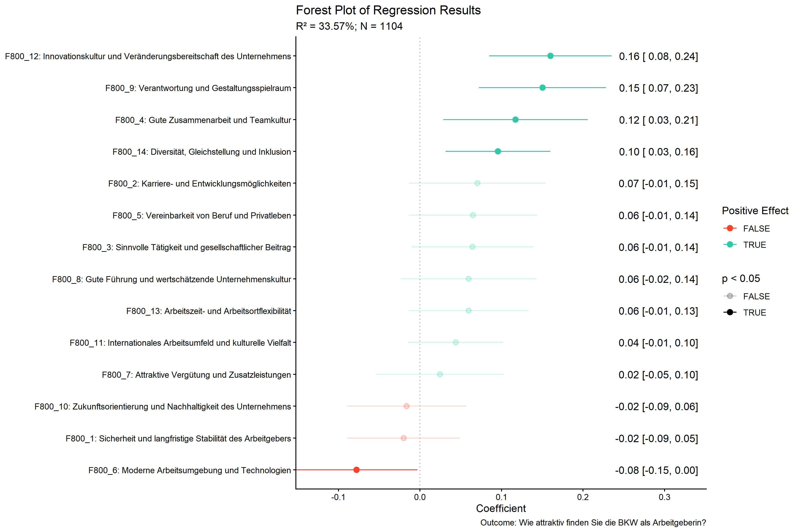

<!-- README.md is generated from README.Rmd. Please edit that file -->

# YouAnalyser <a href="https://eguizarrosales.github.io/YouAnalyser/"></a>

<!-- badges: start -->

<!-- badges: end -->

The goal of YouAnalyser is to provide Analytics Partners of YouGov DACH
with a convenient and standardized way to perform core analyses on
survey data, such as Key Driver Analysis (KDA). The package includes
functions for data preprocessing, exploratory data analysis (EDA), and
KDA (more to come), all designed to work seamlessly with survey data in
the `haven::labelled()` format. By using YouAnalyser, you can save time
and ensure consistency in your analyses across different projects.

## Installation

You can install the development version of YouAnalyser from
[GitHub](https://github.com/) with:

``` r
# install.packages("pak")
pak::pak("EGuizarRosales/YouAnalyser")
```

## Key Driver Analysis (KDA)

This is a basic example which shows you how to conduct a End-2-End Key
Driver Analysis using the YouAnalyser package. For a more detailed
walkthrough, please refer to the vignettes included in the package (use
`vignette("kda", package = "YouAnalyser")`), which provide step-by-step
guides on how to use the various functions for KDA.

``` r
library(YouAnalyser)
library(haven)

res <- kda_regression(
  data = bkw_processed,
  outcome = "F600",
  predictors = paste0("F800_", 1:8),
  diagnostics = TRUE,
  importance_method = "auto"
)
#> Warning: '.cpt' and '.cdl' are depreciated arguments to 'domir' as of version 1.3.
#> Use '.cdl' and '.cpt' as arguments to 'print()' instead.
```

`res` is a list containing the results of the KDA, including the fitted
regression model, variable importance and performance measures, and
plots. The most important outcome is the “Importance Performance Map
Analysis” (IPMA) plot, which can be accessed like this:

``` r
res$plots$ipma_scatterPlot$p
```

If you would like to save the plot, you can use the convenience
functions `ya_choose_file_path()`, which will let you choose a directory
to save the provided file name interactively, and `ya_save_plot()`:

``` r
file_path <- ya_choose_file_path("ipma_plot.jpeg")
ya_save_plot(
  plot = res$plots$ipma_scatterPlot$p,
  file_path = file_path,
  width = 30,
  height = 20
)
```

This will result in the following plot being saved to your chosen
directory:

<figure>

<figcaption aria-hidden="true">IPMA Scatter Plot</figcaption>
</figure>

The data visualized in this plot can be accessed like this:

``` r
res$plots$ipma_scatterPlot$d
#> # A tibble: 8 × 12
#>   predictor_nr predictor label    recommendation Importance_Raw Importance_Ratio
#>          <int> <chr>     <chr>    <fct>                   <dbl>            <dbl>
#> 1            1 F800_1    Sicherh… Possible over…         0.0259           0.0722
#> 2            2 F800_2    Karrier… Concentrate h…         0.0498           0.139 
#> 3            3 F800_3    Sinnvol… Keep up the g…         0.0456           0.127 
#> 4            4 F800_4    Gute Zu… Concentrate h…         0.0590           0.165 
#> 5            5 F800_5    Vereinb… Concentrate h…         0.0449           0.125 
#> 6            6 F800_6    Moderne… Possible over…         0.0405           0.113 
#> 7            7 F800_7    Attrakt… Low priority           0.0442           0.123 
#> 8            8 F800_8    Gute Fü… Concentrate h…         0.0487           0.136 
#> # ℹ 6 more variables: Importance_Percent <dbl>, Importance_Rank <dbl>,
#> #   Performance_Raw <dbl>, Performance_Ratio <dbl>, Performance_Percent <dbl>,
#> #   Performance_Rank <int>
```

We can also export this data to an Excel file that can be used for
reporting in a PowerPoint report:

``` r
file_path <- ya_choose_file_path("ipma_data.xlsx")
ya_save_data_for_chart(
  ipma_scatterPlot_data = res$plots$ipma_scatterPlot$d,
  file_path = file_path
)
```

This will result in a file that looks like this when opened in Excel:

<figure>

<figcaption aria-hidden="true">Screenshot of ipma_data.xlsx</figcaption>
</figure>

There are a lot more plots and outputs available from `res`, so you are
encouraged to explore the object and check out the vignettes for more
details on how to use the package for KDA. Below you find all available
plots in the `res` object:

`res$plots$diagnostics_correlation`



`res$plots$diagnostics_model`


`res$plots$model_forestPlot`



`res$plots$importance_barPlot`


`res$plots$performance_barPlot`


