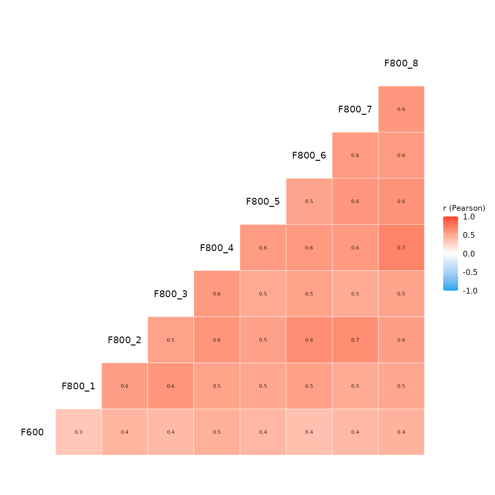
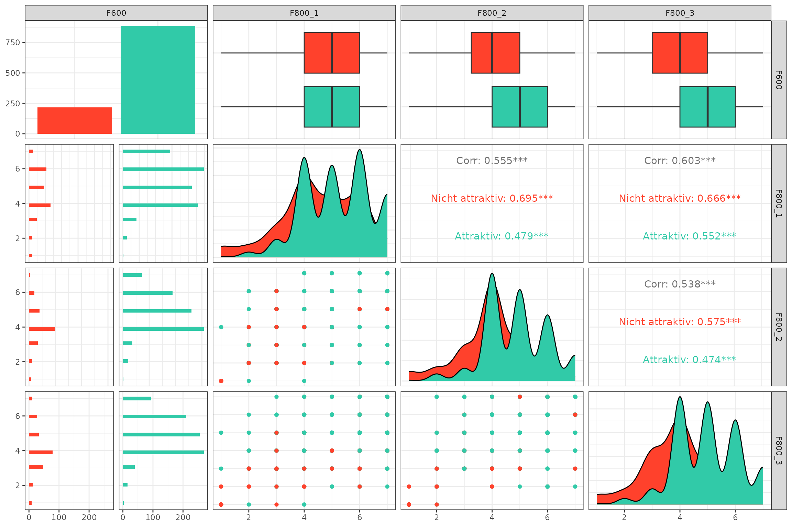

# Exploratory Data Analysis (EDA)

``` r
library(YouAnalyser)
library(haven)
```

## 1. Overview and Descriptive Statistics

The
[`eda_summary()`](https://eguizarrosales.github.io/YouAnalyser/reference/eda_summary.md)
function provides a comprehensive overview of your data:

- It generates a data frame summary that displays for each variable the
  variable label, value labels, frquencies by values, a histogram,
  number of valid values and number of missing values.
- It also computes descriptive statistics for each variable: Mean,
  Standard Deviation, Range, Quartiles, Skewness, and Kurtosis.

By default,
[`eda_summary()`](https://eguizarrosales.github.io/YouAnalyser/reference/eda_summary.md)
opens a browser window to display the summary table and prints the
descriptive statistics in the console. You can control this behavior
with the `console_output` and `browser_output` arguments.

``` r
# Provide summary in console only:
eda_summary(
  data = bkw_processed,
  variables = c("F600", "F800_1", "F800_2"), # If NULL (default), all variables are included
  console_output = TRUE,
  browser_output = FALSE
)
#> Warning: no DISPLAY variable so Tk is not available
#> Warning in png(png_loc <- tempfile(fileext = ".png"), width = 150 *
#> graph.magnif, : unable to open connection to X11 display ''
#> Warning in png(png_loc <- tempfile(fileext = ".png"), width = 150 *
#> graph.magnif, : unable to open connection to X11 display ''
#> Warning in png(png_loc <- tempfile(fileext = ".png"), width = 150 *
#> graph.magnif, : unable to open connection to X11 display ''
#> 
#> ── Data Frame Summary ──────────────────────────────────────────────────────────
#> Data Frame Summary  
#> data  
#> Label: File created by user 'ana-maria.nedelcu' at Wed Feb 11 11:11  
#> Dimensions: 1216 x 3  
#> Duplicates: 1047  
#> 
#> -------------------------------------------------------------------------------------------------------------------------------------------------
#> Variable           Label                                     Stats / Values                 Freqs (% of Valid)   Graph       Valid      Missing  
#> ------------------ ----------------------------------------- ------------------------------ -------------------- ----------- ---------- ---------
#> F600               Wie attraktiv finden Sie die BKW als      1. [1] 1 - Überhaupt nicht a    54 ( 4.4%)                      1216       0        
#> [haven_labelled,   Arbeitgeberin?                            2. [2] 2                        59 ( 4.9%)                      (100.0%)   (0.0%)   
#> vctrs_vctr,                                                  3. [3] 3                       116 ( 9.5%)          I                               
#> double]                                                      4. [4] 4                       470 (38.7%)          IIIIIII                         
#>                                                              5. [5] 5                       305 (25.1%)          IIIII                           
#>                                                              6. [6] 6                       132 (10.9%)          II                              
#>                                                              7. [7] 7 - Sehr attraktiv       80 ( 6.6%)          I                               
#> 
#> F800_1             Sicherheit und langfristige Stabilität    1. [1] Überhaupt nicht gut      18 ( 1.5%)                      1216       0        
#> [haven_labelled,   des Arbeitgebers                          2. [2] 2                        19 ( 1.6%)                      (100.0%)   (0.0%)   
#> vctrs_vctr,                                                  3. [3] 3                        61 ( 5.0%)          I                               
#> double]                                                      4. [4] 4                       310 (25.5%)          IIIII                           
#>                                                              5. [5] 5                       274 (22.5%)          IIII                            
#>                                                              6. [6] 6                       334 (27.5%)          IIIII                           
#>                                                              7. [7] Sehr gut  7             200 (16.4%)          III                             
#> 
#> F800_2             Karriere- und Entwicklungsmöglichkeiten   1. [1] Überhaupt nicht gut      19 ( 1.6%)                      1216       0        
#> [haven_labelled,                                             2. [2] 2                        24 ( 2.0%)                      (100.0%)   (0.0%)   
#> vctrs_vctr,                                                  3. [3] 3                        73 ( 6.0%)          I                               
#> double]                                                      4. [4] 4                       415 (34.1%)          IIIIII                          
#>                                                              5. [5] 5                       339 (27.9%)          IIIII                           
#>                                                              6. [6] 6                       240 (19.7%)          III                             
#>                                                              7. [7] Sehr gut  7             106 ( 8.7%)          I                               
#> -------------------------------------------------------------------------------------------------------------------------------------------------
#> 
#> ── Descriptive Statistics ──────────────────────────────────────────────────────
#> Variable | Mean |   SD |        Range |  Quartiles | Skewness | Kurtosis |    n | n_Missing
#> -------------------------------------------------------------------------------------------
#> F600     | 4.34 | 1.36 | [1.00, 7.00] | 4.00, 5.00 |    -0.28 |     0.35 | 1216 |         0
#> F800_1   | 5.14 | 1.32 | [1.00, 7.00] | 4.00, 6.00 |    -0.51 |     0.12 | 1216 |         0
#> F800_2   | 4.79 | 1.23 | [1.00, 7.00] | 4.00, 6.00 |    -0.27 |     0.37 | 1216 |         0
```

If `browser_output` is set to `TRUE`, the summary table looks like this:


Example summary table

## 2. Variable Correlations

The
[`eda_correlation()`](https://eguizarrosales.github.io/YouAnalyser/reference/eda_correlation.md)
function computes and visualizes the correlation matrix for a set of
variables. It supports different correlation methods (e.g., Pearson,
Spearman) and provides a heatmap visualization of the correlations.

``` r
out <- eda_correlation(
  data = bkw_processed,
  variables = c("F600", paste0("F800_", 1:8)), # If NULL (default), all variables are included
  correlation_type = "pearson"
)

# Inspect pairwise correlations
out$d
#> # Correlation Matrix (pearson-method)
#> 
#> Parameter1 | Parameter2 |    r |       95% CI | t(1214) |         p
#> -------------------------------------------------------------------
#> F600       |     F800_1 | 0.41 | [0.36, 0.46] |   15.69 | < .001***
#> F600       |     F800_2 | 0.49 | [0.45, 0.54] |   19.82 | < .001***
#> F600       |     F800_3 | 0.47 | [0.42, 0.51] |   18.46 | < .001***
#> F600       |     F800_4 | 0.52 | [0.48, 0.56] |   21.31 | < .001***
#> F600       |     F800_5 | 0.48 | [0.44, 0.52] |   19.16 | < .001***
#> F600       |     F800_6 | 0.47 | [0.43, 0.51] |   18.59 | < .001***
#> F600       |     F800_7 | 0.48 | [0.44, 0.52] |   19.17 | < .001***
#> F600       |     F800_8 | 0.50 | [0.46, 0.54] |   20.09 | < .001***
#> F800_1     |     F800_2 | 0.56 | [0.52, 0.60] |   23.49 | < .001***
#> F800_1     |     F800_3 | 0.60 | [0.56, 0.63] |   26.06 | < .001***
#> F800_1     |     F800_4 | 0.58 | [0.54, 0.62] |   24.89 | < .001***
#> F800_1     |     F800_5 | 0.54 | [0.50, 0.58] |   22.33 | < .001***
#> F800_1     |     F800_6 | 0.57 | [0.53, 0.61] |   24.28 | < .001***
#> F800_1     |     F800_7 | 0.57 | [0.53, 0.61] |   24.11 | < .001***
#> F800_1     |     F800_8 | 0.54 | [0.50, 0.58] |   22.46 | < .001***
#> F800_2     |     F800_3 | 0.55 | [0.50, 0.58] |   22.68 | < .001***
#> F800_2     |     F800_4 | 0.63 | [0.60, 0.66] |   28.34 | < .001***
#> F800_2     |     F800_5 | 0.60 | [0.56, 0.63] |   25.84 | < .001***
#> F800_2     |     F800_6 | 0.65 | [0.62, 0.68] |   30.00 | < .001***
#> F800_2     |     F800_7 | 0.66 | [0.63, 0.69] |   30.77 | < .001***
#> F800_2     |     F800_8 | 0.62 | [0.59, 0.65] |   27.62 | < .001***
#> F800_3     |     F800_4 | 0.61 | [0.57, 0.64] |   26.52 | < .001***
#> F800_3     |     F800_5 | 0.54 | [0.49, 0.57] |   22.11 | < .001***
#> F800_3     |     F800_6 | 0.59 | [0.56, 0.63] |   25.72 | < .001***
#> F800_3     |     F800_7 | 0.51 | [0.47, 0.55] |   20.85 | < .001***
#> F800_3     |     F800_8 | 0.59 | [0.55, 0.63] |   25.45 | < .001***
#> F800_4     |     F800_5 | 0.66 | [0.62, 0.69] |   30.26 | < .001***
#> F800_4     |     F800_6 | 0.60 | [0.57, 0.64] |   26.37 | < .001***
#> F800_4     |     F800_7 | 0.64 | [0.60, 0.67] |   28.93 | < .001***
#> F800_4     |     F800_8 | 0.72 | [0.69, 0.75] |   36.37 | < .001***
#> F800_5     |     F800_6 | 0.58 | [0.54, 0.61] |   24.58 | < .001***
#> F800_5     |     F800_7 | 0.65 | [0.62, 0.68] |   29.79 | < .001***
#> F800_5     |     F800_8 | 0.65 | [0.61, 0.68] |   29.58 | < .001***
#> F800_6     |     F800_7 | 0.61 | [0.57, 0.64] |   26.53 | < .001***
#> F800_6     |     F800_8 | 0.61 | [0.58, 0.65] |   26.98 | < .001***
#> F800_7     |     F800_8 | 0.62 | [0.58, 0.65] |   27.50 | < .001***
#> 
#> p-value adjustment method: Holm (1979)
#> Observations: 1216

# Display correlation heatmap
out$p
```



## 3. Going Further

If you need more sophisticated tools for EDA, I highly recommend the
package `GGally`, especially the function
[`GGally::ggpairs()`](https://ggobi.github.io/ggally/reference/ggpairs.html),
which allows you to create a matrix of scatterplots, histograms, and
correlation coefficients for a set of variables. This can be
particularly useful for visualizing relationships between variables in
your survey data.

``` r
# Create a dummy data set with a binary outcome variable coded as factor and three binary predictors
binary_data_example <- bkw_bin_outcome |>
  dplyr::select("F600", paste0("F800_", 1:3)) |>
  dplyr::mutate(F600 = haven::as_factor(F600))

# Visalize pairwise relationships with ggpairs.
GGally::ggpairs(
  data = binary_data_example,
  mapping = ggplot2::aes(color = F600)
) +
  ggplot2::scale_colour_manual(
    values = c("#ff412c", "#31caa8"),
  ) +
  ggplot2::scale_fill_manual(
    values = c("#ff412c", "#31caa8"),
  ) +
  ggplot2::theme_bw()
```



If you are using [Positron](https://positron.posit.co/) as your IDE –
which I cannot stress enough how much I recommend – you can also use the
built-in [Data Explorer](https://positron.posit.co/data-explorer.html),
which provides a user-friendly interface for exploring your data,
including summary statistics, visualizations, and the ability to filter
and subset your data. Finally, also give the amazing
[Databot](https://positron.posit.co/databot.html) a try! It is an AI
assistant that can help you with data analysis tasks, including EDA, and
can be a great companion for your data analysis workflow.
