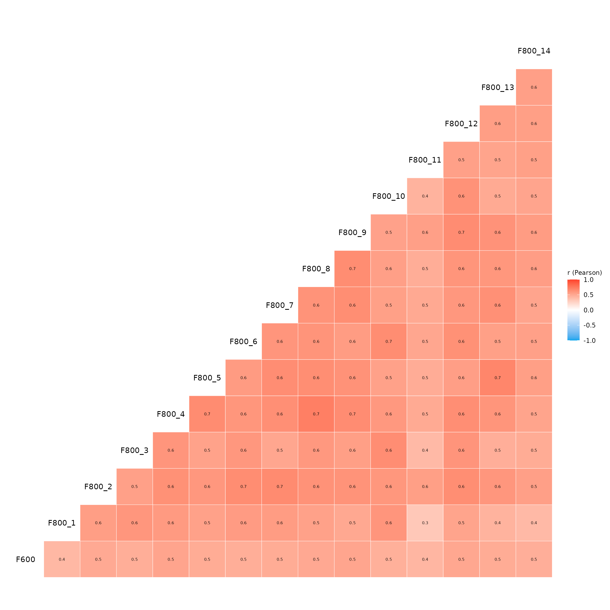

# Key Driver Analysis: Article

``` r
library(YouAnalyser)
library(haven)
```

## Exploratory Data Analysis (EDA)

It is good practice to start with an exploratory data analysis (EDA) to
understand the structure of the data, check for missing values, and
identify any potential issues before performing Key Driver Analysis
(KDA). `YouAnalyser` provides conventient functions for EDA, all
starting with *eda\_*:
[`eda_summary()`](https://eguizarrosales.github.io/YouAnalyser/reference/eda_summary.md)
and `eda_correlations()`. These functions can help you get a quick
overview of your data and identify any necessary preprocessing steps.
But first, we need some data!

### Reading in the data

Note that the data should be in \[haven::labelled()\] format for
`YouAnalyser` to work properly, which is common for survey data. If your
data is in a different format, you may need to convert it before using
`YouAnalyser`.

We start by loading the data. The `YouAnalyser` package includes a
sample dataset called `bwk.sav`, which is in SPSS format. You can read
in your own dataset using the
[`haven::read_sav()`](https://haven.tidyverse.org/reference/read_spss.html)
function, e.g.:

``` r
myOwnData <- haven::read_sav("path/to/your/ownFile.sav")
```

We can read in the included sample dataset as follows:

``` r
example_data <- haven::read_sav(system.file(
  "extdata",
  "bkw.sav",
  package = "YouAnalyser"
))

# This will be equivalent to `example_data <- YouAnalyser::bkw_raw` but using `haven::read_sav()` allows us to see how to read in our own data in the same format.
```

`example_data` contains our outcome variable `F600` and 14 predictor
variables `F800_1` to `F800_14`. To get more information about this
included dataset, you can run
[`?YouAnalyser::bkw_raw`](https://eguizarrosales.github.io/YouAnalyser/reference/bkw_raw.md)
in the R console:

``` r
help(YouAnalyser::bkw_raw)
```

We will select only the variables of interest:

``` r
variables_of_interest <- c("F600", paste0("F800_", 1:14))
example_data <- example_data |>
  dplyr::select(all_of(variables_of_interest))
```

### Get a summary of the data

The
[`eda_summary()`](https://eguizarrosales.github.io/YouAnalyser/reference/eda_summary.md)
function provides a summary of the data, including the number of
observations, number of missing values, and basic statistics for each
variable. This can help you understand the distribution of your data and
identify any potential issues.

``` r
eda_summary(example_data)
```

This will open a new browser window with the summary of the data that
will look something like this:

    #> Warning: no DISPLAY variable so Tk is not available
    #> Warning in png(png_loc <- tempfile(fileext = ".png"), width = 150 *
    #> graph.magnif, : unable to open connection to X11 display ''
    #> Warning in png(png_loc <- tempfile(fileext = ".png"), width = 150 *
    #> graph.magnif, : unable to open connection to X11 display ''
    #> Warning in png(png_loc <- tempfile(fileext = ".png"), width = 150 *
    #> graph.magnif, : unable to open connection to X11 display ''
    #> Warning in png(png_loc <- tempfile(fileext = ".png"), width = 150 *
    #> graph.magnif, : unable to open connection to X11 display ''
    #> Warning in png(png_loc <- tempfile(fileext = ".png"), width = 150 *
    #> graph.magnif, : unable to open connection to X11 display ''
    #> Warning in png(png_loc <- tempfile(fileext = ".png"), width = 150 *
    #> graph.magnif, : unable to open connection to X11 display ''
    #> Warning in png(png_loc <- tempfile(fileext = ".png"), width = 150 *
    #> graph.magnif, : unable to open connection to X11 display ''
    #> Warning in png(png_loc <- tempfile(fileext = ".png"), width = 150 *
    #> graph.magnif, : unable to open connection to X11 display ''
    #> Warning in png(png_loc <- tempfile(fileext = ".png"), width = 150 *
    #> graph.magnif, : unable to open connection to X11 display ''
    #> Warning in png(png_loc <- tempfile(fileext = ".png"), width = 150 *
    #> graph.magnif, : unable to open connection to X11 display ''
    #> Warning in png(png_loc <- tempfile(fileext = ".png"), width = 150 *
    #> graph.magnif, : unable to open connection to X11 display ''
    #> Warning in png(png_loc <- tempfile(fileext = ".png"), width = 150 *
    #> graph.magnif, : unable to open connection to X11 display ''
    #> Warning in png(png_loc <- tempfile(fileext = ".png"), width = 150 *
    #> graph.magnif, : unable to open connection to X11 display ''
    #> Warning in png(png_loc <- tempfile(fileext = ".png"), width = 150 *
    #> graph.magnif, : unable to open connection to X11 display ''
    #> Warning in png(png_loc <- tempfile(fileext = ".png"), width = 150 *
    #> graph.magnif, : unable to open connection to X11 display ''
    #> Warning in png(png_loc <- tempfile(fileext = ".png"), width = 150 *
    #> graph.magnif, : unable to open connection to X11 display ''
    #> Warning in png(png_loc <- tempfile(fileext = ".png"), width = 150 *
    #> graph.magnif, : unable to open connection to X11 display ''
    #> Warning in png(png_loc <- tempfile(fileext = ".png"), width = 150 *
    #> graph.magnif, : unable to open connection to X11 display ''
    #> Warning in png(png_loc <- tempfile(fileext = ".png"), width = 150 *
    #> graph.magnif, : unable to open connection to X11 display ''
    #> Warning in png(png_loc <- tempfile(fileext = ".png"), width = 150 *
    #> graph.magnif, : unable to open connection to X11 display ''
    #> Warning in png(png_loc <- tempfile(fileext = ".png"), width = 150 *
    #> graph.magnif, : unable to open connection to X11 display ''
    #> Warning in png(png_loc <- tempfile(fileext = ".png"), width = 150 *
    #> graph.magnif, : unable to open connection to X11 display ''
    #> Warning in png(png_loc <- tempfile(fileext = ".png"), width = 150 *
    #> graph.magnif, : unable to open connection to X11 display ''
    #> Warning in png(png_loc <- tempfile(fileext = ".png"), width = 150 *
    #> graph.magnif, : unable to open connection to X11 display ''
    #> Warning in png(png_loc <- tempfile(fileext = ".png"), width = 150 *
    #> graph.magnif, : unable to open connection to X11 display ''
    #> Warning in png(png_loc <- tempfile(fileext = ".png"), width = 150 *
    #> graph.magnif, : unable to open connection to X11 display ''
    #> Warning in png(png_loc <- tempfile(fileext = ".png"), width = 150 *
    #> graph.magnif, : unable to open connection to X11 display ''
    #> Warning in png(png_loc <- tempfile(fileext = ".png"), width = 150 *
    #> graph.magnif, : unable to open connection to X11 display ''
    #> Warning in png(png_loc <- tempfile(fileext = ".png"), width = 150 *
    #> graph.magnif, : unable to open connection to X11 display ''
    #> Warning in png(png_loc <- tempfile(fileext = ".png"), width = 150 *
    #> graph.magnif, : unable to open connection to X11 display ''

[TABLE]

Generated by [summarytools](https://github.com/dcomtois/summarytools)
1.1.5 ([R](https://www.r-project.org/) version 4.5.3)  
2026-04-21

We see that there are 4307 missing values in the outcome and predictor
variables. Lets remove these missing values and save the new dataset as
`example_data_clean`:

``` r
example_data_clean <- example_data |>
  tidyr::drop_na()
```

### Check correlations

We can also have a look at the correlation matrix of the variables using
the `eda_correlations()` function. This can help you identify any
potential multicollinearity issues among the independent variables as
well as the strength and directionof the relationships between the
independent variables and the dependent variable. High correlations
among independent variables can indicate multicollinearity, which can
affect the stability and interpretability of the KDA results. Moreover,
we would like to see that the independent variables are correlated
**positivly** with the dependent variable, as KDA is based on the idea
of identifying key drivers that have a positive impact on the outcome.

``` r
corrs <- eda_correlation(example_data_clean, correlation_type = "pearson")
```

A correlation matrix plot is saved in `corrs$p`, which will look like
this:

``` r
corrs$p
```



We see that there are some high correlations among the independent
variables, which may indicate multicollinearity. However, we also see
that all independent variables are positively correlated with the
dependent variable `F600`, which is a good sign for performing KDA.

## Key Driver Analysis (KDA)

Now the real fun starts! \[YouAnalyser::kda_regression()\] is the main
function for performing Key Driver Analysis. There are two ways to use
this function: (1) by providing the raw data and specifying the outcome
variable and predictor variables, or (2) by providing a fitted model
object. The first approach is more straightforward and is recommended
for most users, while the second approach allows more advanced users to
use some shortcuts, as we will show below.

The recommended approach in its minimal form looks like this:

``` r
kda <- kda_regression(
  data = example_data_clean,
  outcome = "F600",
  predictors = paste0("F800_", 1:14)
)
```

Alternatively, we can first fit a model and then provide the fitted
model object to \[YouAnalyser::kda_regression()\]. This for instance
allows for short cuts like `outcome ~ .` in the model formula. If you do
not recognize this syntax, it is perfectly fine to ignore it and use the
first approach as shown above. The second approach would look like this:

``` r
myModel <- lm(F600 ~ ., data = example_data_clean)
kda <- kda_regression(model = myModel)
```

Note that it is only possible to use models fitted with
[`lm()`](https://rdrr.io/r/stats/lm.html) and
[`glm()`](https://rdrr.io/r/stats/glm.html) without interaction terms!
(Interactions make it very difficult to calculate usefull importance
measures for KDA).

It is highly recommended to have a look at the help documentation of
\[YouAnalyser::kda_regression()\] to see all the different options for
performing KDA, including different methods for calculating importance
measures and different ways to visualize the results as well as all the
available output. You can access the help documentation by running
[`?YouAnalyser::kda_regression`](https://eguizarrosales.github.io/YouAnalyser/reference/kda_regression.md)
in the R console.

Let’s have a look at the different outputs generated by
\[YouAnalyser::kda_regression()\]:
