# 3. Key Driver Analysis

``` r

library(YouAnalyser)
#> 
#> ── Welcome to YouAnalyser! ─────────────────────────────────────────────────────
#> ✔ Package loaded successfully!
#> Type `?YouAnalyser` to see the documentation.
#> Visit the package's website for more information:
#> <https://eguizarrosales.github.io/YouAnalyser/>
library(haven)
```

## 1. Recommended Workflow

The following minimal and basic workflow is recommended for performing
Key Driver Analysis (KDA) using the `YouAnalyser` package. This workflow
includes the following steps:

1.  Exploratory Data Analysis (EDA)
2.  Key Driver Analysis (KDA)
3.  Visualize and interpret the results

It is assumed that the data is already in a
[`haven::labelled()`](https://haven.tidyverse.org/reference/labelled.html)
format. If your data is not in this format, you may need to perform some
data processing steps to convert it before using the code below. For an
example of how to do this, please refer to the
[`vignette("dp", package = "YouAnalyser")`](https://eguizarrosales.github.io/YouAnalyser/articles/dp.md)
vignette on Data Processing.

Use the following command to create and open a new R project with a
suitable folder structure for your KDA:

``` r

# Step 1: Create a new project with a suitable folder structure for your KDA analysis:
ya_setup_folder_structure(
  folder_name = "myKDAProject", # Chose a name for your project folder (no spaces or special characters)
  base_path = tcltk::tk_choose.dir(), # Choose the path interactively. You can also specify a path directly as a string, e.g. "C:/Users/YourAbbreviation/Downloads/"
  template = "kda", # Use the KDA template, which creates a folder structure suitable for KDA analyses
  make_rproj = TRUE, # Create an R project file in the main folder of your project
)
```

In your newly opened project, open the file `./scripts/kda.R` (as
instructed in the console output):

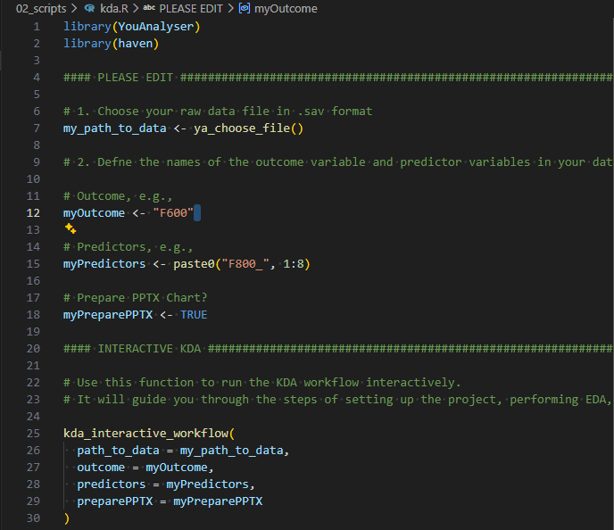

Screenshot of the `kda.R` file

Then follow these steps:

1.  Select (using your mouse) and run (`Ctrl + Enter`) the first two
    lines of code to load the necessary libraries.
2.  Edit lines 12, 15, and 18 to specify the variable names of the
    outcome, the predictors, and whether want to prepare a PPTX report,
    respectively.
3.  Select and run lines 7 to 18. A file explorer window will open.
    Navigate to the folder where your SPSS data is located, select the
    file, and click “Open”.
4.  Select and run lines 25 to 30 to conduct a KDA in an interactive
    way. Check your console and follow the instructions.

For the remainder of this vignette, we will focus on the different
options for conducting the KDA with more control over the analysis. Keep
in mind that you should always conduct an EDA before continuing with a
KDA (this is taken care of by the steps above). For a more detailed
walkthrough of the EDA step, please refer to the
[`vignette("eda", package = "YouAnalyser")`](https://eguizarrosales.github.io/YouAnalyser/articles/eda.md)
vignette on Exploratory Data Analysis.

## 2. The `kda_regression()` Function

The
[`kda_regression()`](https://eguizarrosales.github.io/YouAnalyser/reference/kda_regression.md)
function is the main work horse for conducting KDA. It is a wrapper
function for all the necessary steps (subfunctions) to conduct a KDA,
including fitting a regression model, calculating variable importance
and performance measures, and creating the relevant plots. The function
has several arguments that allow you to customize the analysis, such as
the choice of regression model, variable importance method, and
diagnostic options. You can get help on the function and its arguments
by running
[`help("kda_regression")`](https://eguizarrosales.github.io/YouAnalyser/reference/kda_regression.md)
or
[`?kda_regression`](https://eguizarrosales.github.io/YouAnalyser/reference/kda_regression.md)
in your R console.

You need to provide at least the following arguments to the
[`kda_regression()`](https://eguizarrosales.github.io/YouAnalyser/reference/kda_regression.md)
function:

- Option 1: `data`, `outcome`, and `predictors`
  - `data`: A data frame containing the outcome and predictors. The data
    needs to be in a
    [`haven::labelled()`](https://haven.tidyverse.org/reference/labelled.html)
    format, as is typically the case for SPSS data. If it is not, refer
    to the
    [`vignette("dp", package = "YouAnalyser")`](https://eguizarrosales.github.io/YouAnalyser/articles/dp.md)
    vignette on Data Processing for how to convert your data into a
    labelled format.
  - `outcome`: A single string naming the outcome variable.
  - `predictors`: A character vector of predictor variable names. You
    can use e.g. `paste0("F800_", 1:8)` to specify a sequence of
    variables with similar names.
- Option 2: `model`: Instead of providing the `data`, `outcome`, and
  `predictors` arguments, you can also directly provide a fitted
  regression model object from [`lm()`](https://rdrr.io/r/stats/lm.html)
  or [`glm()`](https://rdrr.io/r/stats/glm.html) to the `model` argument
  (intended for advanced users.)

The
[`kda_regression()`](https://eguizarrosales.github.io/YouAnalyser/reference/kda_regression.md)
function also has several other options. These have recommended default
values and do not need to be changed in most cases:

- `diagnostics = FALSE`: A logical indicating whether to compute model
  diagnostics. This is not necessary for the KDA itself, but can be
  useful for checking the assumptions of the regression model. If set to
  `TRUE`, diagnostic plots will be included in the output.
- `importance_method = "auto"`: The method to calculate variable
  importance. The default “auto” will conduct a dominance analysis if
  the number of predictors is less than 15. Otherwise, it will use the
  “jrw” method, which is a computationally efficient method for
  calculating variable importance in larger models. See below for more
  information on the available variable importance methods.
- `importance_barPlots_args = list()`: A list of additional arguments
  passed to the importance bar plot function. See
  [`kda_importance_barPlot()`](https://eguizarrosales.github.io/YouAnalyser/reference/kda_importance_barPlot.md)
  for details.
- `performance_barPlot_args = list()`: A list of additional arguments
  passed to the performance bar plot function. See
  [`kda_performance_barPlot()`](https://eguizarrosales.github.io/YouAnalyser/reference/kda_performance_barPlot.md)
  for details.
- `ipma_scatterPlot_args = list()`: A list of additional arguments
  passed to the IPMA scatter plot function. See
  [`kda_ipma_scatterPlot()`](https://eguizarrosales.github.io/YouAnalyser/reference/kda_ipma_scatterPlot.md)
  for details.

Regarding the `_args` arguments, you can use these to customize the
appearance of the plots. For example, you can change the default color
of the performance_barPlot from YouGov Red 1 to Teal 1 like this:
`performance_barPlot_args = list(color = yougov_colors[["Teal 1"]])`.
For more information on the available arguments, please refer to the
documentation of the respective plotting functions
`?kda_importance_barPlot()`, `?kda_performance_barPlot()`, and
`?kda_ipma_scatterPlot()`.

### 2.1 Example Usage of `kda_regression()`

We will use the `bkw_processed` dataset, a synthetically generated
dataset based on the structure of real study (call
[`?bkw_processed`](https://eguizarrosales.github.io/YouAnalyser/reference/bkw_processed.md)
for more information). We want to predict the outcome variable `F600`
(BKW employer attractiveness) using the 14 predictor variables `F800_1`
to `F800_14` (various aspects of factors thought to affect employer
attractiveness). We will use JRW method to save compute time. We will
also set `diagnostics = TRUE` to include diagnostic plots in the output.
Finally, we do not want to show variable labels in the final plot, so we
will set `show_labels = FALSE` in the `ipma_scatterPlot_args` argument.

``` r

kda <- kda_regression(
  data = bkw_processed,
  outcome = "F600",
  predictors = paste0("F800_", 1:14),
  importance_method = "jrw",
  diagnostics = TRUE,
  ipma_scatterPlot_args = list(
    show_labels = FALSE
  )
)
```

We can access the IPMA plot using:

``` r

kda$plots$ipma_scatterPlot$p
```

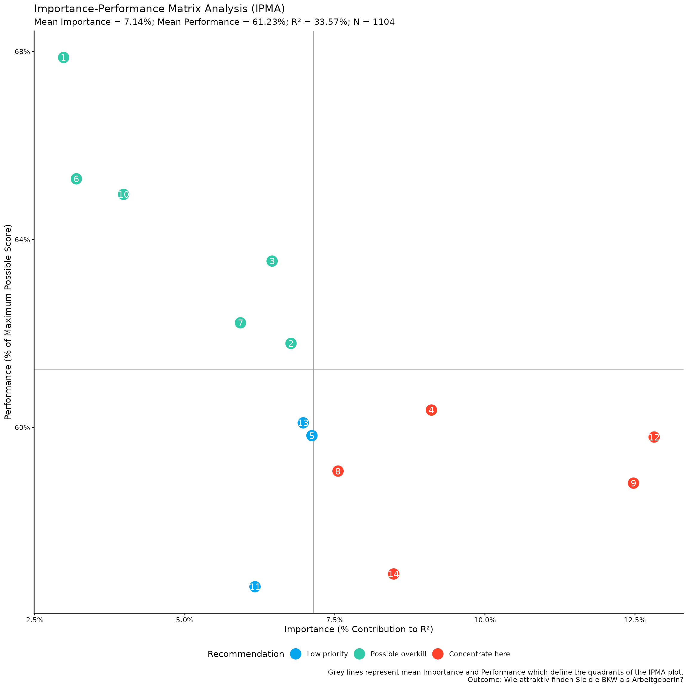

This is a `ggplot` object, so you can further customize it using
`ggplot2` functions. For example, to apply the
[`ggplot2::theme_bw()`](https://ggplot2.tidyverse.org/reference/ggtheme.html)
theme, keep the legend at the bottom, don’t show major and minor grids,
remove the x- and y-axis ticks, labels, and titles, you can do:

``` r

my_ipma_plot <- kda$plots$ipma_scatterPlot$p +
  ggplot2::theme_bw() +
  ggplot2::theme(
    legend.position = "bottom",
    panel.grid.major = ggplot2::element_blank(),
    panel.grid.minor = ggplot2::element_blank(),
    axis.ticks = ggplot2::element_blank(),
    axis.text = ggplot2::element_blank(),
    axis.title = ggplot2::element_blank()
  )
print(my_ipma_plot)
```

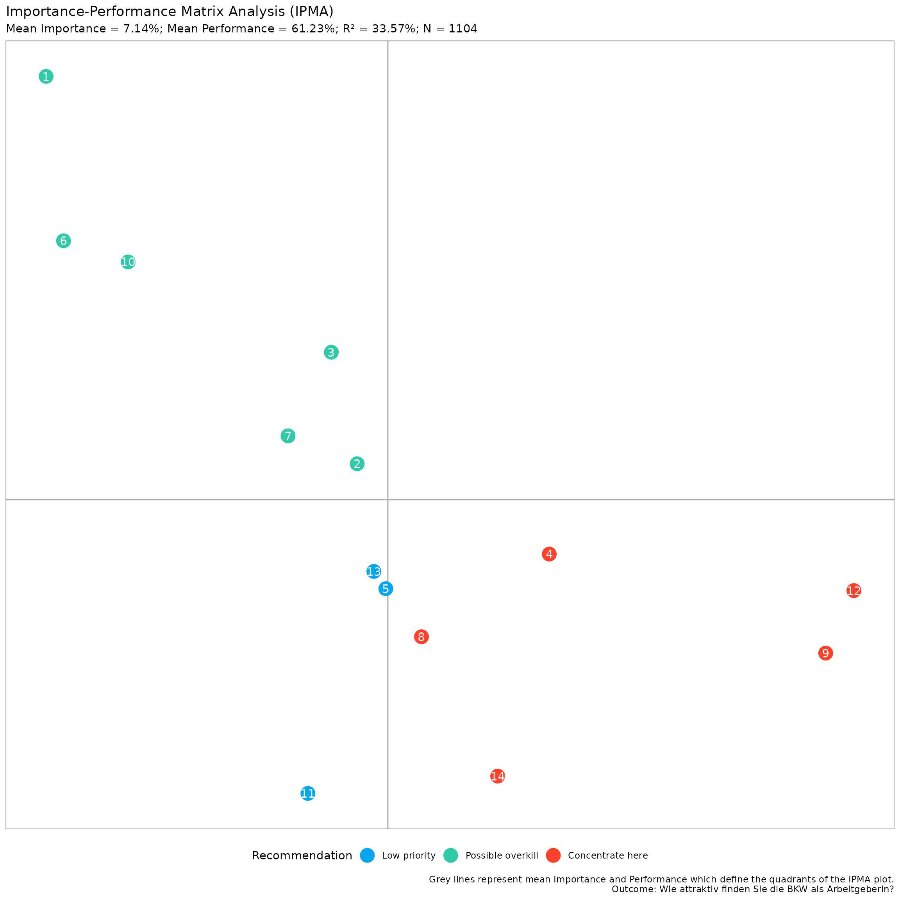

You can save this plot using the convenience function
[`YouAnalyser::ya_save_plot()`](https://eguizarrosales.github.io/YouAnalyser/reference/ya_save_plot.md).
This function allows you to save a plot to a specified file path, with
options to set the width and height (in centimeters) of the saved plot.
If you want to choose the file path interactively, you can use the
[`YouAnalyser::ya_choose_file_path()`](https://eguizarrosales.github.io/YouAnalyser/reference/ya_choose_file_path.md)
function, which will open a dialog box that allows you to choose a
directory where you would like to save the plot. You only need to
additionally provide a file name (`"ipma_plot.jpeg"` in the example
below), and the function will take care of the rest.

``` r

file_path <- ya_choose_file_path("ipma_plot.jpeg")
ya_save_plot(
  plot = my_ipma_plot,
  file_path = file_path,
  width = 30,
  height = 20
)
```

If you saved all the plots generated by our call to
[`kda_regression()`](https://eguizarrosales.github.io/YouAnalyser/reference/kda_regression.md)
above, these would look like this:

`kda$plots$diagnostics_correlation`


`kda$plots$diagnostics_model`


`kda$plots$model_forestPlot`


`kda$plots$importance_barPlot`

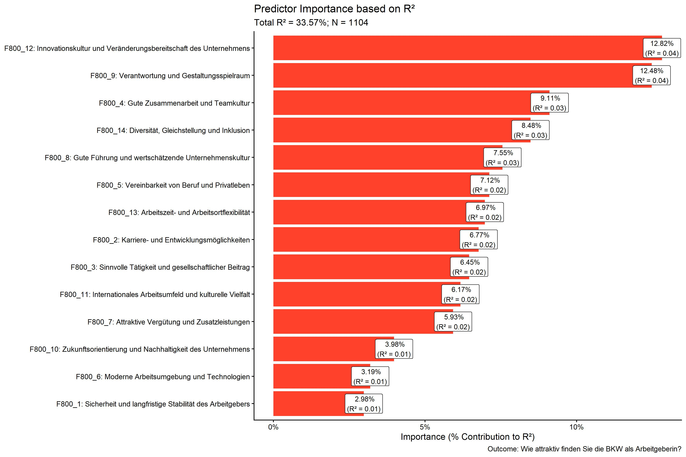

`kda$plots$performance_barPlot`

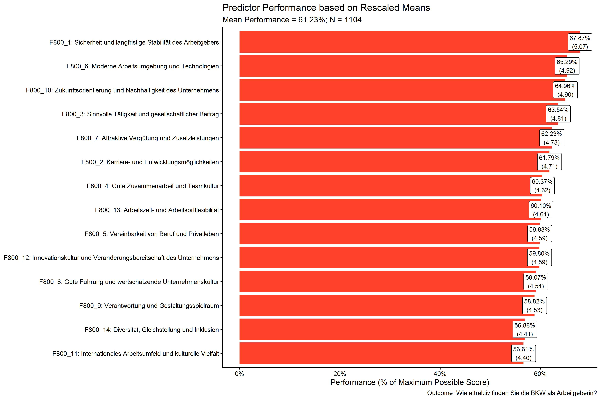

There are a lot of additional outputs saved in the `kda` object, such as
the fitted regression model, variable importance and performance
measures, and diagnostic plots. Try accessing these interactively by
typing `kda$` in your console and using tab-completion to see the
available elements.

### 2.2 KDA with Binary Outcomes

It is also possible to conduct a KDA with a binary outcome variable
using the
[`kda_regression()`](https://eguizarrosales.github.io/YouAnalyser/reference/kda_regression.md)
function, which automatically detects the type of the outcome variable
and fits a logistic regression model if the outcome is binary. The
interpretation of the results are very similar to a KDA with a
continuous outcome.

Let’s have a look at the example data with a binary outcome variable
(“F600”) and the first three predictor variables (“F800_1” to “F800_3”):

``` r

eda_summary(
  data = bkw_bin_outcome,
  variables = c("F600", paste0("F800_", 1:3)),
  browser_output = FALSE
)
#> Warning: no DISPLAY variable so Tk is not available
#> Warning in png(png_loc <- tempfile(fileext = ".png"), width = 150 *
#> graph.magnif, : unable to open connection to X11 display ''
#> Warning in png(png_loc <- tempfile(fileext = ".png"), width = 150 *
#> graph.magnif, : unable to open connection to X11 display ''
#> Warning in png(png_loc <- tempfile(fileext = ".png"), width = 150 *
#> graph.magnif, : unable to open connection to X11 display ''
#> Warning in png(png_loc <- tempfile(fileext = ".png"), width = 150 *
#> graph.magnif, : unable to open connection to X11 display ''
#> 
#> ── Data Frame Summary
#> Data Frame Summary  
#> data  
#> Dimensions: 1104 x 4  
#> Duplicates: 908  
#> 
#> --------------------------------------------------------------------------------------------------------------------------------------------------------
#> Variable           Label                                     Stats / Values                 Freqs (% of Valid)   Graph              Valid      Missing  
#> ------------------ ----------------------------------------- ------------------------------ -------------------- ------------------ ---------- ---------
#> F600               Wie attraktiv finden Sie die BKW als      1. [0] Nicht attraktiv         218 (19.7%)          III                1104       0        
#> [haven_labelled,   Arbeitgeberin?                            2. [1] Attraktiv               886 (80.3%)          IIIIIIIIIIIIIIII   (100.0%)   (0.0%)   
#> vctrs_vctr,                                                                                                                                             
#> double]                                                                                                                                                 
#> 
#> F800_1             Sicherheit und langfristige Stabilität    1. [1] Überhaupt nicht gut      11 ( 1.0%)                             1104       0        
#> [haven_labelled,   des Arbeitgebers                          2. [2] 2                        21 ( 1.9%)                             (100.0%)   (0.0%)   
#> vctrs_vctr,                                                  3. [3] 3                        65 ( 5.9%)          I                                      
#> double]                                                      4. [4] 4                       295 (26.7%)          IIIII                                  
#>                                                              5. [5] 5                       256 (23.2%)          IIII                                   
#>                                                              6. [6] 6                       300 (27.2%)          IIIII                                  
#>                                                              7. [7] Sehr gut  7             156 (14.1%)          II                                     
#> 
#> F800_2             Karriere- und Entwicklungsmöglichkeiten   1. [1] Überhaupt nicht gut      11 ( 1.0%)                             1104       0        
#> [haven_labelled,                                             2. [2] 2                        33 ( 3.0%)                             (100.0%)   (0.0%)   
#> vctrs_vctr,                                                  3. [3] 3                        69 ( 6.2%)          I                                      
#> double]                                                      4. [4] 4                       405 (36.7%)          IIIIIII                                
#>                                                              5. [5] 5                       300 (27.2%)          IIIII                                  
#>                                                              6. [6] 6                       209 (18.9%)          III                                    
#>                                                              7. [7] Sehr gut  7              77 ( 7.0%)          I                                      
#> 
#> F800_3             Sinnvolle Tätigkeit und                   1. [1] Überhaupt nicht gut      12 ( 1.1%)                             1104       0        
#> [haven_labelled,   gesellschaftlicher Beitrag                2. [2] 2                        27 ( 2.4%)                             (100.0%)   (0.0%)   
#> vctrs_vctr,                                                  3. [3] 3                        87 ( 7.9%)          I                                      
#> double]                                                      4. [4] 4                       348 (31.5%)          IIIIII                                 
#>                                                              5. [5] 5                       289 (26.2%)          IIIII                                  
#>                                                              6. [6] 6                       238 (21.6%)          IIII                                   
#>                                                              7. [7] Sehr gut  7             103 ( 9.3%)          I                                      
#> --------------------------------------------------------------------------------------------------------------------------------------------------------
#> 
#> ── Descriptive Statistics
#> Variable | Mean |   SD |        Range |  Quartiles | Skewness | Kurtosis |    n | n_Missing
#> -------------------------------------------------------------------------------------------
#> F600     | 0.80 | 0.40 | [0.00, 1.00] | 1.00, 1.00 |    -1.52 |     0.32 | 1104 |         0
#> F800_1   | 5.07 | 1.29 | [1.00, 7.00] | 4.00, 6.00 |    -0.40 |    -0.10 | 1104 |         0
#> F800_2   | 4.71 | 1.20 | [1.00, 7.00] | 4.00, 6.00 |    -0.17 |     0.23 | 1104 |         0
#> F800_3   | 4.81 | 1.26 | [1.00, 7.00] | 4.00, 6.00 |    -0.22 |    -0.03 | 1104 |         0
```

We can run the KDA with the binary outcome variable in the same way as
before, just with a different dataset. Note that estimating a KDA for a
binary outcome variable can take a bit longer than for a continuous
outcome variable, especially if you have many predictors, because
logistic regression models are more computationally intensive to fit
than linear regression models. This is especially the case if you use
the “domir” method for calculating variable importance, which is why we
will use the “jrw” method in this example.

``` r

kda_bin <- kda_regression(
  data = bkw_bin_outcome,
  outcome = "F600",
  predictors = paste0("F800_", 1:14),
  importance_method = "jrw",
  diagnostics = TRUE
)
#> Cannot simulate residuals for models of class `glm`. Please try
#>   `check_model(..., residual_type = "normal")` instead.
```

We get essentially the same plots as for the KDA with the continuous
outcome variable. Some differences include:

- `kda_bin$plots$diagnostics_model` is adjusted for the logistic
  regression model, so it shows different diagnostic plots than the
  linear regression model. (See Model Diagnostics section below for more
  information on how to interpret these plots.)
- The `kda_bin$plots$model_forestPlot` now shows the Log-Odds. Negative
  Log-Odds indicate that higher values of the predictor are associated
  with lower probabilities of the outcome being 1 (i.e., the event of
  interest), while positive Log-Odds indicate that higher values of the
  predictor are associated with higher probabilities of the outcome
  being 1. The further away from zero, the stronger the association
  between the predictor and the outcome.
- $`R^2`$ values in the `kda_bin$plots$importance_barPlot`,
  `kda_bin$plots$performance_barPlot`, and
  `kda_bin$plots$ipma_scatterPlot` now refer to $`R^2_{Tjur}`$, which is
  a pseudo-$`R^2`$ measure that is commonly used for logistic regression
  models. The same rules for interpretation apply as for the $`R^2`$
  values in the KDA with a continuous outcome variable.

`kda_bin$plots$diagnostics_correlation`

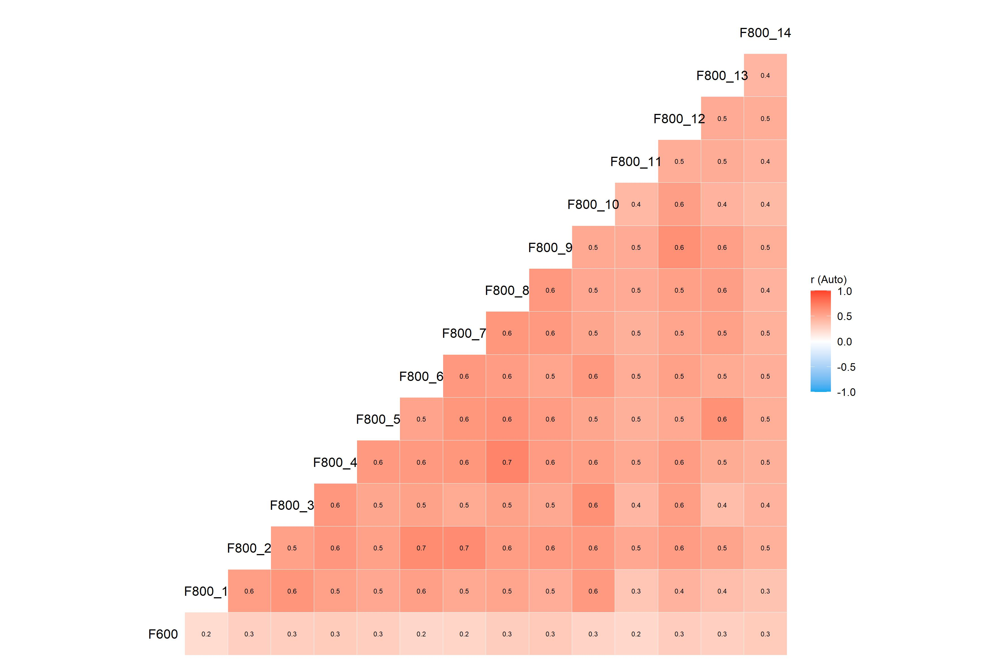

`kda_bin$plots$diagnostics_model`


`kda_bin$plots$model_forestPlot`


`kda_bin$plots$importance_barPlot`


`kda_bin$plots$performance_barPlot`

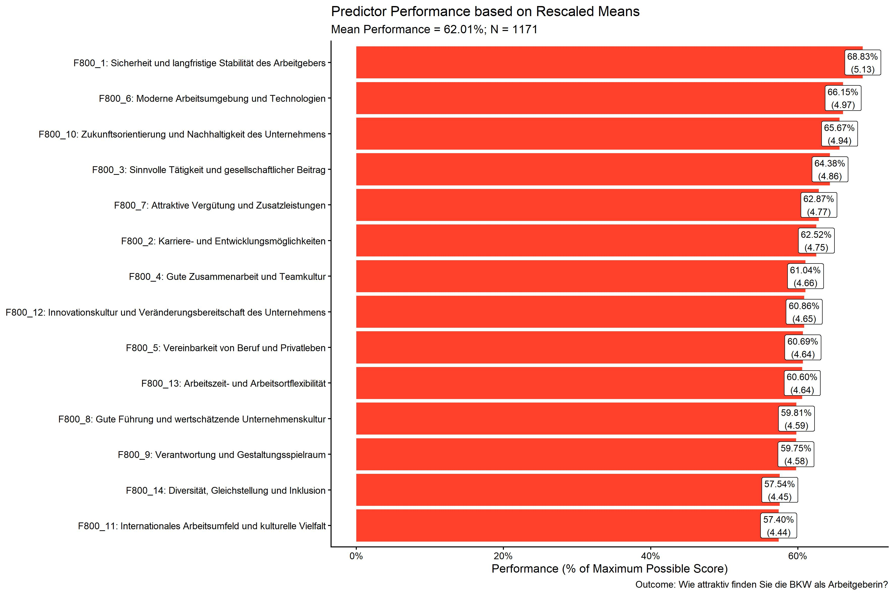

`kda_bin$plots$ipma_scatterPlot`

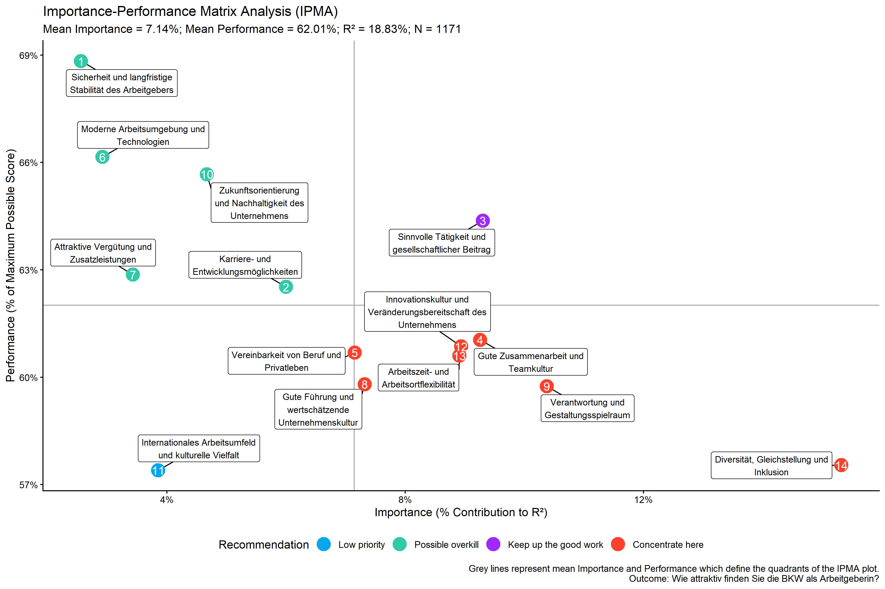

Pro tip: If you prefer to get the forest plot in a Odds-Ratio format
instead of Log-Odds, you can use:

``` r

kda_forestPlot(
  model = kda_bin$model$model,
  model_parameters_args = list(exponentiate = TRUE)
)$p
```

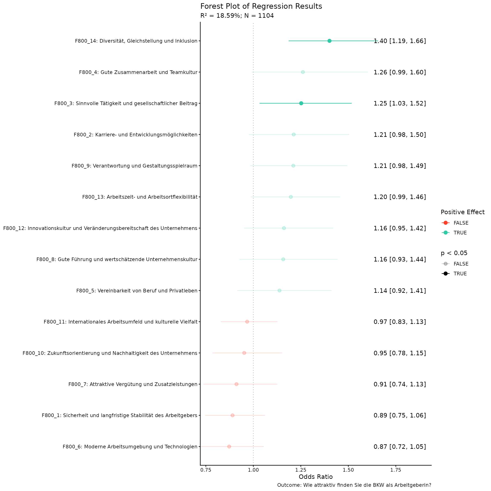

In this case, the interpretation of the forest plot changes slightly. An
Odds-Ratio greater than 1 indicates that higher values of the predictor
are associated with higher odds of the outcome being 1 (i.e., the event
of interest), while an Odds-Ratio less than 1 indicates that higher
values of the predictor are associated with lower odds of the outcome
being 1. An Odds-Ratio of exactly 1 indicates no association between the
predictor and the outcome. For example, an Odds-Ratio of 1.5 would
indicate that a one-unit increase in the predictor is associated with a
50% increase in the odds of the outcome being 1, while an Odds-Ratio of
0.7 would indicate that a one-unit increase in the predictor is
associated with a 30% decrease in the odds of the outcome being 1.

### 2.3 Charts for PowerPoint Reporting

`YouAnalyser` includes functions to facilitate the creation of an IPMA
chart for reporting in PowerPoint.

First, we need to save the IPMA plot data in an Excel file with the
right structure for reporting. We can do this using the
[`kda_save_data_for_chart()`](https://eguizarrosales.github.io/YouAnalyser/reference/kda_save_data_for_chart.md)
function, which takes the IPMA scatter plot data and saves it to an
Excel file. You can choose the file path interactively using the
[`ya_choose_file_path()`](https://eguizarrosales.github.io/YouAnalyser/reference/ya_choose_file_path.md)
function.

``` r

file_path <- ya_choose_file_path("ipma_data.xlsx")
kda_save_data_for_chart(
  ipma_scatterPlot_data = kda$plots$ipma_scatterPlot$d,
  file_path = file_path
)
```

This will result in a file that looks like this when opened in Excel:


Screenshot of ipma_data.xlsx (right-click -\> “Open image in new tab” to
zoom in)

This file has the right structure and contains all the information
needed to update a pre-formatted PowerPoint template that you can use
for reporting. You can copy the PowerPoint template to your desired
location using the
[`kda_copy_pptx_template()`](https://eguizarrosales.github.io/YouAnalyser/reference/kda_copy_pptx_template.md)
function:

``` r

file_path <- ya_choose_file_path("ipma_chart.pptx")
kda_copy_pptx_template(file_path)
```

Follow these steps to update the PowerPoint template with the exported
data:

1.  Open the ipma data saved in the Excel, i.e. `ipma_data.xlsx` in this
    example.
2.  Select the data in the grey box, i.e. **A5:D18** in this example,
    and copy it (Ctrl + C).
3.  Open the PowerPoint template, i.e. `ipma_chart.pptx` in this
    example.
4.  Go to the slide with the IPMA chart, right-click on the chart, and
    select “Edit Data” \> “Edit Data in Excel”. This will open the
    “Chart in Microsoft PowerPoint” window, which looks just like Excel.
5.  In the “Chart in Microsoft PowerPoint” window, select the Cell
    **A5**, right-click, and paste values only (Ctrl + Shift + V). The
    chart in the PowerPoint will automatically update based on the
    pasted data. You can close the “Chart in Microsoft PowerPoint”
    window after pasting the data.
6.  In the IPMA chart, we need to update part of the chart that is
    displayed as well as the cross defining the quadrants. For this,
    arrange the PowerPoint (`ipma_chart.pptx`) and the Excel
    (`ipma_data.xlsx`) window side by side.
    - Double-click on the horizontal line in the PowerPoint chart. This
      will open the “Format Axis” pane on the right-hand-side (see
      screenshot below). Copy and paste (Ctrl + C and Ctrl + V) the
      value in Cell **L10** of the Excel sheet (X-Achsenminimum) to the
      “Bounds: Minimum” field in the “Format Axis” pane. Now copy and
      paste the value in Cell **L9** (X-Achsenmaximum) to the “Bounds:
      Maximum” field in the “Format Axis” pane. Finally, copy and paste
      the value in Cell **L8** (X-Achsenwert) to the “Vertical axis
      crosses: Axis value” field in the “Format Axis” pane.
    - Double-click on the vertical line in the PowerPoint chart. This
      will open the “Format Axis” pane on the right-hand-side. Copy and
      paste (Ctrl + C and Ctrl + V) the value in Cell **M10** of the
      Excel sheet (Y-Achsenminimum) to the “Bounds: Minimum” field in
      the “Format Axis” pane. Now copy and paste the value in Cell
      **M9** (Y-Achsenmaximum) to the “Bounds: Maximum” field in the
      “Format Axis” pane. Finally, copy and paste the value in Cell
      **M8** (Y-Achsenwert) to the “Horizontal axis crosses: Axis value”
      field in the “Format Axis” pane.
7.  Update the right-hand side legend of the chart with the item numbers
    and statements. Use the information summarised in the Excel file in
    **O5:V35** to do this.


“Format Axis” pane in PowerPoint that opens if you double-click on the
horizontal line in the chart.

### 2.4 Importance Methods

There are three methods available for calculating variable importance in
the
[`kda_regression()`](https://eguizarrosales.github.io/YouAnalyser/reference/kda_regression.md)
function:

1.  `"domir"` **Dominance Analysis**: This method decomposes the
    R-squared of the regression model into contributions from each
    predictor variable. It provides a comprehensive measure of variable
    importance but can be computationally intensive for models with many
    predictors. This method is also known as *Relative Importance*,
    *LMG* or *Shapley Value Decomposition*.
2.  `"jrw"` **Johnson Relative Weights**: Similarly to dominance
    analysis, this method decomposes the R-squared of the regression
    model into contributions from each predictor variable. However, it
    does so using a heuristic method that is computationally more
    efficient and can handle models with a larger number of predictors.
3.  `"sumOfCoefficients"` **Sum of Absolute (Standardized)
    Coefficients**: This method calculates variable importance by taking
    the sum of the absolute values of the (standardized) regression
    coefficients for each predictor variable. This is a simpler and more
    computationally efficient method, but it does not account for the
    intercorrelations between predictors and may not provide as accurate
    a measure of variable importance as the other two methods. It is
    included for legacy reasons and is not recommended for use in most
    cases.

Note that the default method is set to `"auto"`, which will
automatically choose between `"domir"` and `"jrw"` based on the number
of predictors in the model. If you have fewer than 15 predictors, it
will use `"domir"`. If you have 15 or more predictors, it will use
`"jrw"`. Set the `importance_method` argument to one of the three
methods above to override the default behavior and specify a method
directly.

For an extended discussion of the **Dominance Analysis** and **Johnson
Relative Weights** methods, please refer to the subsections at the end
of this vignette. They are inteded for interested readers or as a
reference if clients want to know more about the methods used in the
KDA. For additional ressources, please refer to the following resources:

- Vignette of the `domir` package:
  <https://cran.r-project.org/web/packages/domir/vignettes/domir_basics.html>
- Technical paper for the Dominance Analysis Method: Grömping,
  Ulrike. 2007. Estimators of Relative Importance in Linear Regression
  Based on Variance Decomposition. *The American Statistician* 61 (2):
  139–47. <https://doi.org/10.1198/000313007X188252>.
- Technical paper for the *Johnson Relative Weights* Method: Johnson, J.
  (2000). A heuristic method for estimating the relative weight of
  predictor variables in multiple regression. *Multivariate Behavioral
  Research*, 35, 1–19 . <https://doi.org/10.1207/S15327906MBR3501_1>

### 2.5 Model Diagnostics

A short note on model diagnostics. The plot
`kda$plots$diagnostics_model`can also be computed like this:

``` r

diagnostics <- performance::check_model(kda$model$model)
print(diagnostics)
```

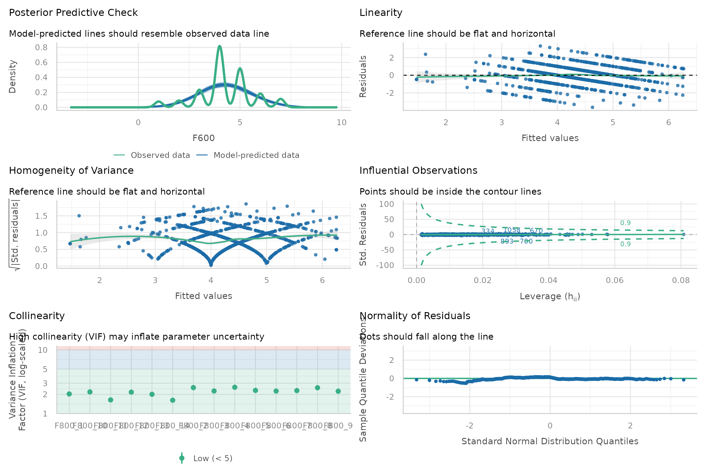

This gives you the advantage that you can also access infomation that
can be helpful to interpret the plot, e.g.:

``` r

diagnostics$OUTLIERS
#> OK: No outliers detected.
#> - Based on the following method and threshold: cook (1).
#> - For variable: (Whole model)
```

Please refer to the following documentation for more information on how
to interpret the diagnostic plots and what you can do if the assumptions
underlying the regression model are violated: [Checking model
assumption - linear
models](https://easystats.github.io/performance/articles/check_model.html#linear-models-are-all-assumptions-for-linear-models-met).

## 3. Scaling KDA for Multiple Groups

You may find yourself in a situation where you want to conduct the same
KDA for multiple groups in your data, e.g. for different demographic
subgroups or segments. In this case, you can use the
[`kda_regression()`](https://eguizarrosales.github.io/YouAnalyser/reference/kda_regression.md)
function in combination the looping functions from the `purrr` package,
most notably with
[`purrr::map()`](https://purrr.tidyverse.org/reference/map.html). Let’s
walk through an example of how to do this.

Let’s suppose our participants belong to different segments defined
beforehand, and we want to conduct a KDA for each segment separately. We
can do this by splitting our data into a list of data frames, where each
data frame corresponds to a segment, and then applying the
[`kda_regression()`](https://eguizarrosales.github.io/YouAnalyser/reference/kda_regression.md)
function to each data frame in the list using
[`purrr::map()`](https://purrr.tidyverse.org/reference/map.html).

In the `bkw_synthetic` dataset, we have a variable called `cluster`that
contains the segment membership of each participant:

``` r

# Inspect the value labels of the variable "cluster"
sjlabelled::get_labels(bkw_synthetic$cluster) |>
  tibble::enframe(name = "value", value = "label")
#> # A tibble: 6 × 2
#>   value label                                                                   
#>   <int> <chr>                                                                   
#> 1     1 Cluster 1: Betrieb, Installation & Instandhaltung von Anlagen und Netzen
#> 2     2 Cluster 2: Planung, Projektierung, Engineering, Architektur & Bauplanung
#> 3     3 Cluster 3: Energie-, Finanz- & Commodity-Handel / Trading & Marktsteuer…
#> 4     4 Cluster 4: IT, Software, Daten & digitale Lösungen                      
#> 5     5 Cluster 5: Support- & Querschnittsfunktionen                            
#> 6     6 Cluster 6: Early Careers

# Inspect the distribution of participants across segments:
datawizard::data_tabulate(bkw_synthetic$cluster, remove_na = TRUE)
#> Cluster (bkw_synthetic$cluster) <numeric>
#> # total N=1216 valid N=1216
#> 
#> Value |   N | Raw % | Valid % | Cumulative %
#> ------+-----+-------+---------+-------------
#> 1     | 146 | 12.01 |   12.01 |        12.01
#> 2     | 202 | 16.61 |   16.61 |        28.62
#> 3     |  98 |  8.06 |    8.06 |        36.68
#> 4     | 270 | 22.20 |   22.20 |        58.88
#> 5     | 229 | 18.83 |   18.83 |        77.71
#> 6     | 271 | 22.29 |   22.29 |       100.00

# Note: there is also a variable "country". We can use datawizard::data_tabulate()
# to quickly inspect cross-tabulations:
datawizard::data_tabulate(
  bkw_synthetic$cluster,
  by = bkw_synthetic$country,
  remove_na = TRUE
)
#> bkw_synthetic$cluster |  CH |  DE | Total
#> ----------------------+-----+-----+------
#> 1                     | 117 |  29 |   146
#> 2                     | 141 |  61 |   202
#> 3                     |  74 |  24 |    98
#> 4                     | 177 |  93 |   270
#> 5                     | 195 |  34 |   229
#> 6                     | 151 | 120 |   271
#> ----------------------+-----+-----+------
#> Total                 | 855 | 361 |  1216
```

The trick is now to devide the data into smaller subsets for each
segment using
[`tidyr::nest()`](https://tidyr.tidyverse.org/reference/nest.html),
which creates a list-column containing the data frames for each segment.
We can then apply the
[`kda_regression()`](https://eguizarrosales.github.io/YouAnalyser/reference/kda_regression.md)
function to each data frame in the list using `tidyr::map()`. Here’s how
to do this:

``` r

# Split the data into a list of data frames, one for each segment.
bkw_by_segment <- bkw_synthetic |>
  tidyr::nest(.by = cluster) |>
  dplyr::arrange(cluster) # Arrange by cluster for cosmetic reasons.

#  Note how "data" now in each row contains an entire data frame for the
# respective segment:
print(bkw_by_segment)
#> # A tibble: 6 × 2
#>   cluster                                                               data    
#>   <dbl+lbl>                                                             <list>  
#> 1 1 [Cluster 1: Betrieb, Installation & Instandhaltung von Anlagen und… <tibble>
#> 2 2 [Cluster 2: Planung, Projektierung, Engineering, Architektur & Bau… <tibble>
#> 3 3 [Cluster 3: Energie-, Finanz- & Commodity-Handel / Trading & Markt… <tibble>
#> 4 4 [Cluster 4: IT, Software, Daten & digitale Lösungen]                <tibble>
#> 5 5 [Cluster 5: Support- & Querschnittsfunktionen]                      <tibble>
#> 6 6 [Cluster 6: Early Careers]                                          <tibble>

# purrr::map() applies a function to each element of a list. In this case, we
# apply the kda_regression() function with a specific set of arguments to each
# data frame in the "data" column. The only thing that changes across iterations
# is the data frame that is used as input. To make make the following code easier
# to read, we define a temporary function called "my_kda_function" that takes a
# data frame as input and applies the kda_regression() function to it with the
# specified arguments. We then pass this function to purrr::map() to apply it to
# each data frame in the "data" column.

# Helper function
my_kda_function <- function(df) {
  kda_regression(
    data = df,
    outcome = "F600",
    predictors = paste0("F800_", 1:14),
    importance_method = "jrw",
    diagnostics = TRUE
  )
}

# Apply helper function to each data frame in the "data" column using purrr::map()
bkw_kda_by_segment <- bkw_by_segment |>
  dplyr::mutate(kda_result = purrr::map(data, my_kda_function))

# Note how we added the column "kda_result" which now contains the KDA results
# for each segment:
print(bkw_kda_by_segment)
#> # A tibble: 6 × 3
#>   cluster                                                  data     kda_result  
#>   <dbl+lbl>                                                <list>   <list>      
#> 1 1 [Cluster 1: Betrieb, Installation & Instandhaltung vo… <tibble> <named list>
#> 2 2 [Cluster 2: Planung, Projektierung, Engineering, Arch… <tibble> <named list>
#> 3 3 [Cluster 3: Energie-, Finanz- & Commodity-Handel / Tr… <tibble> <named list>
#> 4 4 [Cluster 4: IT, Software, Daten & digitale Lösungen]   <tibble> <named list>
#> 5 5 [Cluster 5: Support- & Querschnittsfunktionen]         <tibble> <named list>
#> 6 6 [Cluster 6: Early Careers]                             <tibble> <named list>
```

All results for each segment are now stored in the `kda_result` column
of the `bkw_kda_by_segment` data frame. You can access the results for
each segment using
[`dplyr::filter()`](https://dplyr.tidyverse.org/reference/filter.html),
[`dplyr::select()`](https://dplyr.tidyverse.org/reference/select.html)
and
[`purrr::pluck()`](https://purrr.tidyverse.org/reference/pluck.html).
For example, to access the KDA results for the sixth segment, you can
do:

``` r

cluster6_ipma_ScatterPlot <- bkw_kda_by_segment |>
  dplyr::filter(cluster == 6) |>
  dplyr::select(kda_result) |>
  purrr::pluck(1, 1, "plots", "ipma_scatterPlot", "p")
print(cluster6_ipma_ScatterPlot)
```

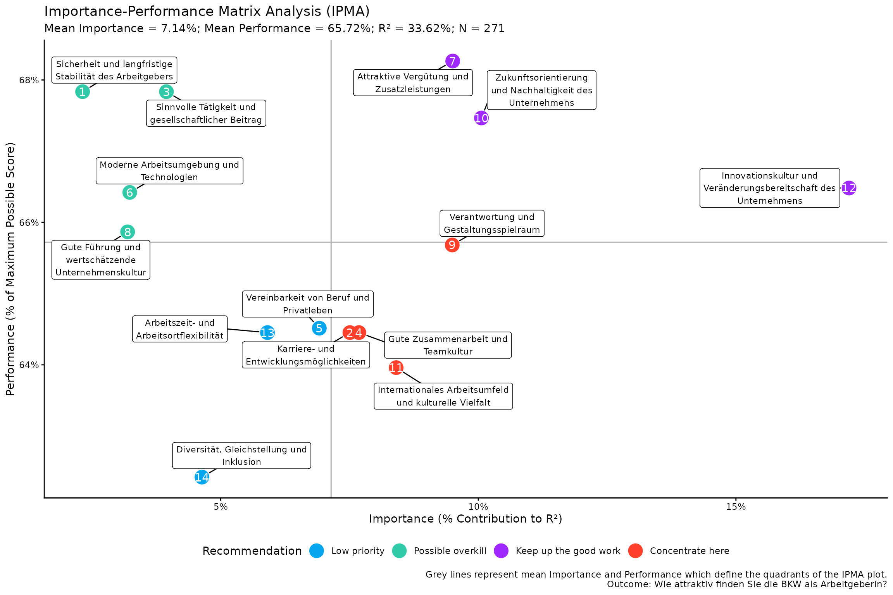

If you would like to save all IPMA scatter plots for each segment, you
can do this using
[`purrr::iwalk()`](https://purrr.tidyverse.org/reference/imap.html),
which allows you to iterate over the rows of the `bkw_kda_by_segment`
data frame and save the IPMA scatter plot for each segment using the
[`ya_save_plot()`](https://eguizarrosales.github.io/YouAnalyser/reference/ya_save_plot.md)
function. Here’s how to do this:

``` r

# Choose the output folder interactively. You can also specify a path directly
# as a string, e.g. "C:/Users/YourAbbreviation/Downloads/"
my_output_folder <- tcltk::tk_choose.dir()

# Iterate over the rows of the bkw_kda_by_segment data frame and save the IPMA
# scatter plot for each segment.
purrr::walk2(
  .x = bkw_kda_by_segment$kda_result,
  .y = bkw_kda_by_segment$cluster,
  .f = \(kda_result, cluster) {
    ipma_plot <- kda_result$plots$ipma_scatterPlot$p
    cluster_id <- as.integer(cluster)

    ya_save_plot(
      plot = ipma_plot,
      file_path = paste0(
        my_output_folder,
        "/segment_",
        cluster_id,
        "_ipma_scatterPlot.jpeg"
      ),
      width = 30,
      height = 20,
      verbose = FALSE
    )
  }
)
```

As a final note: Please be aware that results for subgroups should only
be interpreted if the sample size for the subgroup is sufficiently
large. If the sample size is too small, the results may be unstable and
not generalizable to the population of interest. There is no hard rule
for what constitutes a “sufficiently large” sample size, as it depends
on various factors such as the number of predictors in the model, the
expected effect sizes, and the desired level of statistical power.
However, as a general guideline, it is often recommended to have at
least 10-15 observations per predictor variable in the model for
reliable estimation. Therefore, if you have a model with 14 predictors,
you would ideally want at least 140-210 observations in each subgroup to
ensure stable and interpretable results.

## 4. Missing Data

Often it is the case that your data contains missing values, e.g., due
to “no-response” answers in surveys. While **it is stongly recommendend
to carefully consider whether to include such “no-response” answer
options for crtical questions that are planned to be submitted to KDA
later in your survey in the first place (do not include such an answer
option if not necessary)**, you may find yourself in a situation where
you have to deal with missing data.

You can use the
[`kda_regression_with_imputation()`](https://eguizarrosales.github.io/YouAnalyser/reference/kda_regression_with_imputation.md)
function to conduct a KDA with imputed data. This function is a wrapper
around the
[`kda_regression()`](https://eguizarrosales.github.io/YouAnalyser/reference/kda_regression.md)
function that first imputes the missing data using the `mice` package
and then conducts the KDA on the imputed data. The
[`kda_regression_with_imputation()`](https://eguizarrosales.github.io/YouAnalyser/reference/kda_regression_with_imputation.md)
function has the same arguments as the
[`kda_regression()`](https://eguizarrosales.github.io/YouAnalyser/reference/kda_regression.md)
function, with some additional arguments for controlling the imputation
process. You can get help on the function and its arguments by running
[`help("kda_regression_with_imputation")`](https://eguizarrosales.github.io/YouAnalyser/reference/kda_regression_with_imputation.md)
or
[`?kda_regression_with_imputation`](https://eguizarrosales.github.io/YouAnalyser/reference/kda_regression_with_imputation.md)
in your R console.

Before running the
[`kda_regression_with_imputation()`](https://eguizarrosales.github.io/YouAnalyser/reference/kda_regression_with_imputation.md)
function, make sure that the data you provide only includes the
variables that are relevant for the imputation and the KDA, i.e., the
outcome variable and the predictor variables as well as a few (optional)
variables you think might also affect the outcome and predictor
variables. Also, make sure that the missing values are coded correctly
as `NA` and the “no-answer” labels are removed from the data. See the
“Important Note on Missing Values” section in the
[`vignette("dp", package = "YouAnalyser")`](https://eguizarrosales.github.io/YouAnalyser/articles/dp.md)
vignette on Data Processing for more information on how to prepare your
data. **This is especially important if your data was collected using
Survalyzer**.

For demonstration purposes, a version of the `bkw_processed` dataset
with missing values has been created and is available as `bkw_missings`.
Let’s have a look at the distribution of missing values in this dataset:

``` r

eda_summary(bkw_missings, console_output = TRUE, browser_output = FALSE)
#> Warning in png(png_loc <- tempfile(fileext = ".png"), width = 150 *
#> graph.magnif, : unable to open connection to X11 display ''
#> Warning in png(png_loc <- tempfile(fileext = ".png"), width = 150 *
#> graph.magnif, : unable to open connection to X11 display ''
#> Warning in png(png_loc <- tempfile(fileext = ".png"), width = 150 *
#> graph.magnif, : unable to open connection to X11 display ''
#> Warning in png(png_loc <- tempfile(fileext = ".png"), width = 150 *
#> graph.magnif, : unable to open connection to X11 display ''
#> Warning in png(png_loc <- tempfile(fileext = ".png"), width = 150 *
#> graph.magnif, : unable to open connection to X11 display ''
#> Warning in png(png_loc <- tempfile(fileext = ".png"), width = 150 *
#> graph.magnif, : unable to open connection to X11 display ''
#> Warning in png(png_loc <- tempfile(fileext = ".png"), width = 150 *
#> graph.magnif, : unable to open connection to X11 display ''
#> Warning in png(png_loc <- tempfile(fileext = ".png"), width = 150 *
#> graph.magnif, : unable to open connection to X11 display ''
#> Warning in png(png_loc <- tempfile(fileext = ".png"), width = 150 *
#> graph.magnif, : unable to open connection to X11 display ''
#> Warning in png(png_loc <- tempfile(fileext = ".png"), width = 150 *
#> graph.magnif, : unable to open connection to X11 display ''
#> Warning in png(png_loc <- tempfile(fileext = ".png"), width = 150 *
#> graph.magnif, : unable to open connection to X11 display ''
#> Warning in png(png_loc <- tempfile(fileext = ".png"), width = 150 *
#> graph.magnif, : unable to open connection to X11 display ''
#> Warning in png(png_loc <- tempfile(fileext = ".png"), width = 150 *
#> graph.magnif, : unable to open connection to X11 display ''
#> Warning in png(png_loc <- tempfile(fileext = ".png"), width = 150 *
#> graph.magnif, : unable to open connection to X11 display ''
#> Warning in png(png_loc <- tempfile(fileext = ".png"), width = 150 *
#> graph.magnif, : unable to open connection to X11 display ''
#> Warning in png(png_loc <- tempfile(fileext = ".png"), width = 150 *
#> graph.magnif, : unable to open connection to X11 display ''
#> Warning in png(png_loc <- tempfile(fileext = ".png"), width = 150 *
#> graph.magnif, : unable to open connection to X11 display ''
#> Warning in png(png_loc <- tempfile(fileext = ".png"), width = 150 *
#> graph.magnif, : unable to open connection to X11 display ''
#> 
#> ── Data Frame Summary
#> Data Frame Summary  
#> data  
#> Dimensions: 1216 x 18  
#> Duplicates: 0  
#> 
#> --------------------------------------------------------------------------------------------------------------------------------------------------------------
#> Variable           Label                                      Stats / Values                 Freqs (% of Valid)     Graph                 Valid      Missing  
#> ------------------ ------------------------------------------ ------------------------------ ---------------------- --------------------- ---------- ---------
#> id                 Unique Identifier                          Mean (sd) : 608.5 (351.2)      1216 distinct values   : : : : : : : : : :   1216       0        
#> [haven_labelled,                                              min < med < max:                                      : : : : : : : : : :   (100.0%)   (0.0%)   
#> vctrs_vctr,                                                   1 < 608.5 < 1216                                      : : : : : : : : : :                       
#> double]                                                       IQR (CV) : 607.5 (0.6)                                : : : : : : : : : :                       
#>                                                                                                                     : : : : : : : : : :                       
#> 
#> country            Land                                       1. [1] CH                      855 (70.3%)            IIIIIIIIIIIIII        1216       0        
#> [haven_labelled,                                              2. [2] DE                      361 (29.7%)            IIIII                 (100.0%)   (0.0%)   
#> vctrs_vctr,                                                                                                                                                   
#> double]                                                                                                                                                       
#> 
#> cluster            Cluster                                    1. [1] Cluster 1: Betrieb, I   146 (12.0%)            II                    1216       0        
#> [haven_labelled,                                              2. [2] Cluster 2: Planung, P   202 (16.6%)            III                   (100.0%)   (0.0%)   
#> vctrs_vctr,                                                   3. [3] Cluster 3: Energie-,     98 ( 8.1%)            I                                         
#> double]                                                       4. [4] Cluster 4: IT, Softwa   270 (22.2%)            IIII                                      
#>                                                               5. [5] Cluster 5: Support- &   229 (18.8%)            III                                       
#>                                                               6. [6] Cluster 6: Early Care   271 (22.3%)            IIII                                      
#> 
#> F600               Wie attraktiv finden Sie die BKW als       1. [1] 1 - Überhaupt nicht a    44 ( 3.6%)                                  1211       5        
#> [haven_labelled,   Arbeitgeberin?                             2. [2] 2                        50 ( 4.1%)                                  (99.6%)    (0.4%)   
#> vctrs_vctr,                                                   3. [3] 3                       132 (10.9%)            II                                        
#> double]                                                       4. [4] 4                       472 (39.0%)            IIIIIII                                   
#>                                                               5. [5] 5                       312 (25.8%)            IIIII                                     
#>                                                               6. [6] 6                       117 ( 9.7%)            I                                         
#>                                                               7. [7] 7 - Sehr attraktiv       84 ( 6.9%)            I                                         
#> 
#> F800_1             Sicherheit und langfristige Stabilität     1. [1] Überhaupt nicht gut      11 ( 0.9%)                                  1210       6        
#> [haven_labelled,   des Arbeitgebers                           2. [2] 2                        21 ( 1.7%)                                  (99.5%)    (0.5%)   
#> vctrs_vctr,                                                   3. [3] 3                        67 ( 5.5%)            I                                         
#> double]                                                       4. [4] 4                       303 (25.0%)            IIIII                                     
#>                                                               5. [5] 5                       276 (22.8%)            IIII                                      
#>                                                               6. [6] 6                       338 (27.9%)            IIIII                                     
#>                                                               7. [7] Sehr gut  7             194 (16.0%)            III                                       
#> 
#> F800_2             Karriere- und Entwicklungsmöglichkeiten    1. [1] Überhaupt nicht gut      11 ( 0.9%)                                  1204       12       
#> [haven_labelled,                                              2. [2] 2                        34 ( 2.8%)                                  (99.0%)    (1.0%)   
#> vctrs_vctr,                                                   3. [3] 3                        70 ( 5.8%)            I                                         
#> double]                                                       4. [4] 4                       418 (34.7%)            IIIIII                                    
#>                                                               5. [5] 5                       330 (27.4%)            IIIII                                     
#>                                                               6. [6] 6                       244 (20.3%)            IIII                                      
#>                                                               7. [7] Sehr gut  7              97 ( 8.1%)            I                                         
#> 
#> F800_3             Sinnvolle Tätigkeit und                    1. [1] Überhaupt nicht gut      12 ( 1.0%)                                  1207       9        
#> [haven_labelled,   gesellschaftlicher Beitrag                 2. [2] 2                        27 ( 2.2%)                                  (99.3%)    (0.7%)   
#> vctrs_vctr,                                                   3. [3] 3                        91 ( 7.5%)            I                                         
#> double]                                                       4. [4] 4                       363 (30.1%)            IIIIII                                    
#>                                                               5. [5] 5                       313 (25.9%)            IIIII                                     
#>                                                               6. [6] 6                       270 (22.4%)            IIII                                      
#>                                                               7. [7] Sehr gut  7             131 (10.9%)            II                                        
#> 
#> F800_4             Gute Zusammenarbeit und Teamkultur         1. [1] Überhaupt nicht gut      13 ( 1.1%)                                  1209       7        
#> [haven_labelled,                                              2. [2] 2                        21 ( 1.7%)                                  (99.4%)    (0.6%)   
#> vctrs_vctr,                                                   3. [3] 3                        82 ( 6.8%)            I                                         
#> double]                                                       4. [4] 4                       466 (38.5%)            IIIIIII                                   
#>                                                               5. [5] 5                       335 (27.7%)            IIIII                                     
#>                                                               6. [6] 6                       207 (17.1%)            III                                       
#>                                                               7. [7] Sehr gut  7              85 ( 7.0%)            I                                         
#> 
#> F800_5             Vereinbarkeit von Beruf und Privatleben    1. [1] Überhaupt nicht gut      14 ( 1.2%)                                  1208       8        
#> [haven_labelled,                                              2. [2] 2                        28 ( 2.3%)                                  (99.3%)    (0.7%)   
#> vctrs_vctr,                                                   3. [3] 3                       107 ( 8.9%)            I                                         
#> double]                                                       4. [4] 4                       448 (37.1%)            IIIIIII                                   
#>                                                               5. [5] 5                       315 (26.1%)            IIIII                                     
#>                                                               6. [6] 6                       191 (15.8%)            III                                       
#>                                                               7. [7] Sehr gut  7             105 ( 8.7%)            I                                         
#> 
#> F800_6             Moderne Arbeitsumgebung und Technologien   1. [1] Überhaupt nicht gut      14 ( 1.2%)                                  1209       7        
#> [haven_labelled,                                              2. [2] 2                        26 ( 2.2%)                                  (99.4%)    (0.6%)   
#> vctrs_vctr,                                                   3. [3] 3                        67 ( 5.5%)            I                                         
#> double]                                                       4. [4] 4                       325 (26.9%)            IIIII                                     
#>                                                               5. [5] 5                       340 (28.1%)            IIIII                                     
#>                                                               6. [6] 6                       285 (23.6%)            IIII                                      
#>                                                               7. [7] Sehr gut  7             152 (12.6%)            II                                        
#> 
#> F800_7             Attraktive Vergütung und                   1. [1] Überhaupt nicht gut      13 ( 1.1%)                                  1206       10       
#> [haven_labelled,   Zusatzleistungen                           2. [2] 2                        18 ( 1.5%)                                  (99.2%)    (0.8%)   
#> vctrs_vctr,                                                   3. [3] 3                        82 ( 6.8%)            I                                         
#> double]                                                       4. [4] 4                       443 (36.7%)            IIIIIII                                   
#>                                                               5. [5] 5                       292 (24.2%)            IIII                                      
#>                                                               6. [6] 6                       239 (19.8%)            III                                       
#>                                                               7. [7] Sehr gut  7             119 ( 9.9%)            I                                         
#> 
#> F800_8             Gute Führung und wertschätzende            1. [1] Überhaupt nicht gut      16 ( 1.3%)                                  1207       9        
#> [haven_labelled,   Unternehmenskultur                         2. [2] 2                        32 ( 2.7%)                                  (99.3%)    (0.7%)   
#> vctrs_vctr,                                                   3. [3] 3                        98 ( 8.1%)            I                                         
#> double]                                                       4. [4] 4                       472 (39.1%)            IIIIIII                                   
#>                                                               5. [5] 5                       310 (25.7%)            IIIII                                     
#>                                                               6. [6] 6                       187 (15.5%)            III                                       
#>                                                               7. [7] Sehr gut  7              92 ( 7.6%)            I                                         
#> 
#> F800_9             Verantwortung und Gestaltungsspielraum     1. [1] Überhaupt nicht gut      22 ( 1.8%)                                  1209       7        
#> [haven_labelled,                                              2. [2] 2                        19 ( 1.6%)                                  (99.4%)    (0.6%)   
#> vctrs_vctr,                                                   3. [3] 3                       120 ( 9.9%)            I                                         
#> double]                                                       4. [4] 4                       457 (37.8%)            IIIIIII                                   
#>                                                               5. [5] 5                       304 (25.1%)            IIIII                                     
#>                                                               6. [6] 6                       190 (15.7%)            III                                       
#>                                                               7. [7] Sehr gut  7              97 ( 8.0%)            I                                         
#> 
#> F800_10            Zukunftsorientierung und Nachhaltigkeit    1. [1] Überhaupt nicht gut      22 ( 1.8%)                                  1207       9        
#> [haven_labelled,   des Unternehmens                           2. [2] 2                        20 ( 1.7%)                                  (99.3%)    (0.7%)   
#> vctrs_vctr,                                                   3. [3] 3                        66 ( 5.5%)            I                                         
#> double]                                                       4. [4] 4                       325 (26.9%)            IIIII                                     
#>                                                               5. [5] 5                       330 (27.3%)            IIIII                                     
#>                                                               6. [6] 6                       322 (26.7%)            IIIII                                     
#>                                                               7. [7] Sehr gut  7             122 (10.1%)            II                                        
#> 
#> F800_11            Internationales Arbeitsumfeld und          1. [1] Überhaupt nicht gut      27 ( 2.2%)                                  1213       3        
#> [haven_labelled,   kulturelle Vielfalt                        2. [2] 2                        75 ( 6.2%)            I                     (99.8%)    (0.2%)   
#> vctrs_vctr,                                                   3. [3] 3                       156 (12.9%)            II                                        
#> double]                                                       4. [4] 4                       394 (32.5%)            IIIIII                                    
#>                                                               5. [5] 5                       266 (21.9%)            IIII                                      
#>                                                               6. [6] 6                       193 (15.9%)            III                                       
#>                                                               7. [7] Sehr gut  7             102 ( 8.4%)            I                                         
#> 
#> F800_12            Innovationskultur und                      1. [1] Überhaupt nicht gut      18 ( 1.5%)                                  1210       6        
#> [haven_labelled,   Veränderungsbereitschaft des               2. [2] 2                        27 ( 2.2%)                                  (99.5%)    (0.5%)   
#> vctrs_vctr,        Unternehmens                               3. [3] 3                       116 ( 9.6%)            I                                         
#> double]                                                       4. [4] 4                       413 (34.1%)            IIIIII                                    
#>                                                               5. [5] 5                       331 (27.4%)            IIIII                                     
#>                                                               6. [6] 6                       210 (17.4%)            III                                       
#>                                                               7. [7] Sehr gut  7              95 ( 7.9%)            I                                         
#> 
#> F800_13            Arbeitszeit- und Arbeitsortflexibilität    1. [1] Überhaupt nicht gut      12 ( 1.0%)                                  1208       8        
#> [haven_labelled,                                              2. [2] 2                        32 ( 2.6%)                                  (99.3%)    (0.7%)   
#> vctrs_vctr,                                                   3. [3] 3                       114 ( 9.4%)            I                                         
#> double]                                                       4. [4] 4                       424 (35.1%)            IIIIIII                                   
#>                                                               5. [5] 5                       332 (27.5%)            IIIII                                     
#>                                                               6. [6] 6                       199 (16.5%)            III                                       
#>                                                               7. [7] Sehr gut  7              95 ( 7.9%)            I                                         
#> 
#> F800_14            Diversität, Gleichstellung und Inklusion   1. [1] Überhaupt nicht gut      34 ( 2.8%)                                  1210       6        
#> [haven_labelled,                                              2. [2] 2                        47 ( 3.9%)                                  (99.5%)    (0.5%)   
#> vctrs_vctr,                                                   3. [3] 3                        94 ( 7.8%)            I                                         
#> double]                                                       4. [4] 4                       470 (38.8%)            IIIIIII                                   
#>                                                               5. [5] 5                       328 (27.1%)            IIIII                                     
#>                                                               6. [6] 6                       168 (13.9%)            II                                        
#>                                                               7. [7] Sehr gut  7              69 ( 5.7%)            I                                         
#> --------------------------------------------------------------------------------------------------------------------------------------------------------------
#> 
#> ── Descriptive Statistics
#> Variable |   Mean |     SD |           Range |      Quartiles | Skewness
#> ------------------------------------------------------------------------
#> id       | 608.50 | 351.17 | [1.00, 1216.00] | 304.75, 912.25 |     0.00
#> country  |   1.30 |   0.46 |    [1.00, 2.00] |     1.00, 2.00 |     0.89
#> cluster  |   3.86 |   1.70 |    [1.00, 6.00] |     2.00, 5.00 |    -0.30
#> F600     |   4.36 |   1.32 |    [1.00, 7.00] |     4.00, 5.00 |    -0.19
#> F800_1   |   5.15 |   1.29 |    [1.00, 7.00] |     4.00, 6.00 |    -0.44
#> F800_2   |   4.78 |   1.21 |    [1.00, 7.00] |     4.00, 6.00 |    -0.19
#> F800_3   |   4.88 |   1.27 |    [1.00, 7.00] |     4.00, 6.00 |    -0.24
#> F800_4   |   4.70 |   1.16 |    [1.00, 7.00] |     4.00, 5.00 |    -0.06
#> F800_5   |   4.67 |   1.23 |    [1.00, 7.00] |     4.00, 5.00 |    -0.03
#> F800_6   |   5.00 |   1.27 |    [1.00, 7.00] |     4.00, 6.00 |    -0.38
#> F800_7   |   4.80 |   1.23 |    [1.00, 7.00] |     4.00, 6.00 |    -0.07
#> F800_8   |   4.62 |   1.22 |    [1.00, 7.00] |     4.00, 5.00 |    -0.06
#> F800_9   |   4.62 |   1.24 |    [1.00, 7.00] |     4.00, 5.00 |    -0.08
#> F800_10  |   4.97 |   1.26 |    [1.00, 7.00] |     4.00, 6.00 |    -0.54
#> F800_11  |   4.47 |   1.40 |    [1.00, 7.00] |     4.00, 5.00 |    -0.12
#> F800_12  |   4.67 |   1.24 |    [1.00, 7.00] |     4.00, 6.00 |    -0.16
#> F800_13  |   4.66 |   1.22 |    [1.00, 7.00] |     4.00, 5.00 |    -0.06
#> F800_14  |   4.48 |   1.26 |    [1.00, 7.00] |     4.00, 5.00 |    -0.32
#> 
#> Variable | Kurtosis |    n | n_Missing
#> --------------------------------------
#> id       |    -1.20 | 1216 |         0
#> country  |    -1.21 | 1216 |         0
#> cluster  |    -1.19 | 1216 |         0
#> F600     |     0.44 | 1211 |         5
#> F800_1   |    -0.11 | 1210 |         6
#> F800_2   |     0.15 | 1204 |        12
#> F800_3   |    -0.10 | 1207 |         9
#> F800_4   |     0.35 | 1209 |         7
#> F800_5   |     0.10 | 1208 |         8
#> F800_6   |     0.14 | 1209 |         7
#> F800_7   | 4.11e-03 | 1206 |        10
#> F800_8   |     0.26 | 1207 |         9
#> F800_9   |     0.27 | 1209 |         7
#> F800_10  |     0.48 | 1207 |         9
#> F800_11  |    -0.29 | 1213 |         3
#> F800_12  |     0.16 | 1210 |         6
#> F800_13  |     0.06 | 1208 |         8
#> F800_14  |     0.56 | 1210 |         6
```

We already see that there are some missing values in outcome as well as
in the predictor variables. A more detailed overview of the missing
values can be obtained by running the following code.

``` r

mice::md.pattern(bkw_missings, rotate.names = TRUE)
```

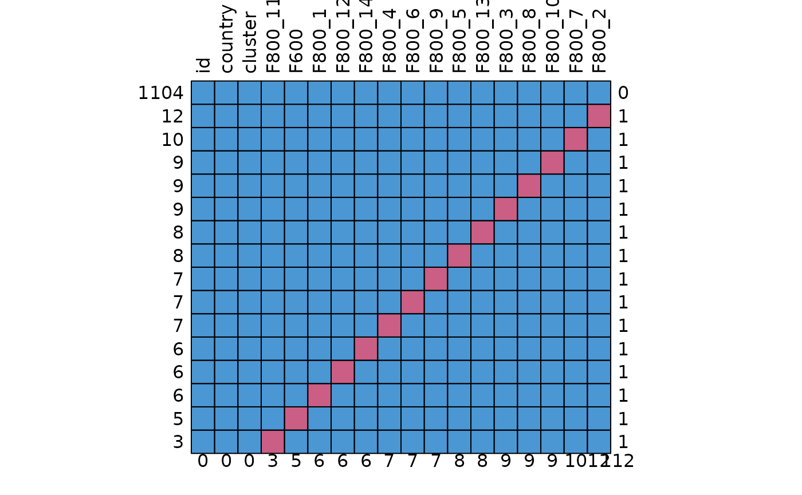

    #>      id country cluster F800_11 F600 F800_1 F800_12 F800_14 F800_4 F800_6
    #> 1104  1       1       1       1    1      1       1       1      1      1
    #> 12    1       1       1       1    1      1       1       1      1      1
    #> 10    1       1       1       1    1      1       1       1      1      1
    #> 9     1       1       1       1    1      1       1       1      1      1
    #> 9     1       1       1       1    1      1       1       1      1      1
    #> 9     1       1       1       1    1      1       1       1      1      1
    #> 8     1       1       1       1    1      1       1       1      1      1
    #> 8     1       1       1       1    1      1       1       1      1      1
    #> 7     1       1       1       1    1      1       1       1      1      1
    #> 7     1       1       1       1    1      1       1       1      1      0
    #> 7     1       1       1       1    1      1       1       1      0      1
    #> 6     1       1       1       1    1      1       1       0      1      1
    #> 6     1       1       1       1    1      1       0       1      1      1
    #> 6     1       1       1       1    1      0       1       1      1      1
    #> 5     1       1       1       1    0      1       1       1      1      1
    #> 3     1       1       1       0    1      1       1       1      1      1
    #>       0       0       0       3    5      6       6       6      7      7
    #>      F800_9 F800_5 F800_13 F800_3 F800_8 F800_10 F800_7 F800_2    
    #> 1104      1      1       1      1      1       1      1      1   0
    #> 12        1      1       1      1      1       1      1      0   1
    #> 10        1      1       1      1      1       1      0      1   1
    #> 9         1      1       1      1      1       0      1      1   1
    #> 9         1      1       1      1      0       1      1      1   1
    #> 9         1      1       1      0      1       1      1      1   1
    #> 8         1      1       0      1      1       1      1      1   1
    #> 8         1      0       1      1      1       1      1      1   1
    #> 7         0      1       1      1      1       1      1      1   1
    #> 7         1      1       1      1      1       1      1      1   1
    #> 7         1      1       1      1      1       1      1      1   1
    #> 6         1      1       1      1      1       1      1      1   1
    #> 6         1      1       1      1      1       1      1      1   1
    #> 6         1      1       1      1      1       1      1      1   1
    #> 5         1      1       1      1      1       1      1      1   1
    #> 3         1      1       1      1      1       1      1      1   1
    #>           7      8       8      9      9       9     10     12 112

These outputs can be interpreted as follows:

- **Columns:** Variables in the dataset.
- **Left Row Numbers:** Answer to the question “How many rows show this
  specific pattern of missingness?” For example, the first row shows
  that there are 1,104 rows with no missing values (i.e., all variables
  have a value). The second row shows that there are 12 rows with only
  the variable “F800_2” missing, and so on. Missings are coded as a 0 in
  the table in the colomn output and as red squares in the plot output.
  Non-missings are coded as a 1 in the table output and as blue squares
  in the plot output.
- **Right Row Numbers:** Answer to the question “How many missings are
  in this specific missing pattern?” In the example we see that all
  missing patern have only 1 missing value. This pattern is unusual and
  is due to the fact that this missing data were synthetically generated
  for demonstration purposes. In real data, it is more common to have
  missing patterns with multiple missing values.
- **Bottom Column Numbers:** Answer to the question “How many missings
  are in this specific variable?” For example, the fourth column shows
  that there are 3 missing values in the variable “F800_1”, the last
  column shows that there are 12 missing values in the variable
  “F800_2”.
- **Number in the bottom right corner:** Answer to the question “How
  many missings are in the entire dataset?” In this example, there are
  112 missing values in total.

Let’s apply the
[`kda_regression_with_imputation()`](https://eguizarrosales.github.io/YouAnalyser/reference/kda_regression_with_imputation.md)
function to the `bkw_missings` dataset. We will use the default
arguments for the imputation process, but we will set
`importance_method = "jrw"` to save compute time. These default settings
will run `m = 100` imputations using the predictive mean matching method
(`method = "pmm"`) and a seed of `seed = 123` for reproducibility. You
can change these settings by providing a list of imputation arguments to
the `imputation_args` argument of the
[`kda_regression_with_imputation()`](https://eguizarrosales.github.io/YouAnalyser/reference/kda_regression_with_imputation.md)
function. For more information on the available imputation arguments,
please refer to the documentation of the
[`mice::mice`](https://amices.org/mice/reference/mice.html) package.
**Be aware that code execution will take a while (some minutes)**. If it
takes too long for your use case, consider lowering m to, e.g. `m = 20`.

``` r

res_imp <- kda_regression_with_imputation(
  data = bkw_missings |>
    # Select only  the relevant variables for the imputation and KDA
    dplyr::select(country, cluster, F600, paste0("F800_", 1:14)),
  outcome = "F600",
  predictors = paste0("F800_", 1:14),
  importance_method = "jrw"
)
```

The output is essentially the same as for the usual
[`kda_regression()`](https://eguizarrosales.github.io/YouAnalyser/reference/kda_regression.md)
function, but the results are now based on the imputed data. You can
access the plots and other outputs in the same way as for the usual
[`kda_regression()`](https://eguizarrosales.github.io/YouAnalyser/reference/kda_regression.md)
function, e.g., `res_imp$plots$ipma_scatterPlot$p` to access the IPMA
scatter plot. Note that there is an additional line in the subtitle,
indicating that the results are based on imputed data (number of missing
values, number of imputations, and method of aggregating the results
across imputations).

``` r

res_imp$plots$ipma_scatterPlot$p
```

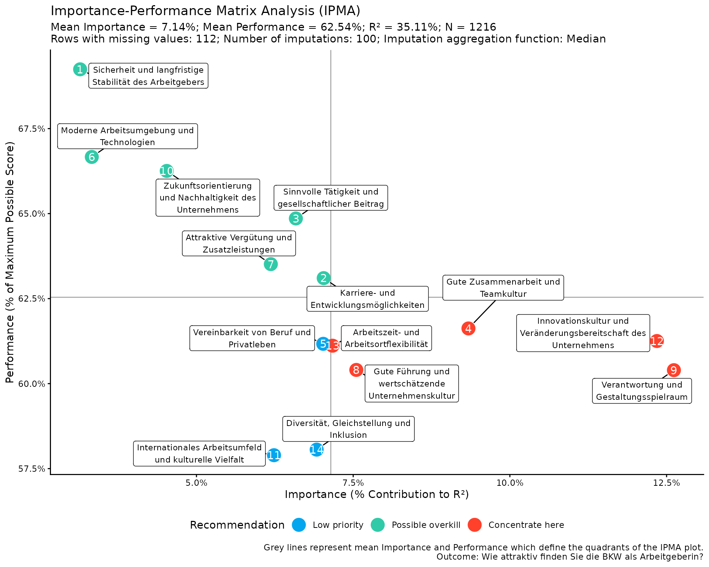

Two plots are different from the regular
[`kda_regression()`](https://eguizarrosales.github.io/YouAnalyser/reference/kda_regression.md)
function: `res_imp$plots$diagnostics_importance` and
`res_imp$plots$diagnostics_performance` shows the distribution of
variable importance and performance across the imputations.The plots
show histograms (background) and the points with intervals at the
bottom. The points indicate the median, the bolder inner line contains
66% (2/3) of the probability density and the thinner outer line contains
95% of the probability density.

Imputation worked well if the distribution of variable importance and
performance across the imputations is relatively narrow, i.e., if the
points are close together and the intervals are not too wide. If the
distribution is very wide, this may indicate that the results are not
stable across the imputations and should be interpreted with caution.
The examples below show very good imputation diagnostics (narrow
distributions).

``` r

res_imp$plots$diagnostics_importance
```

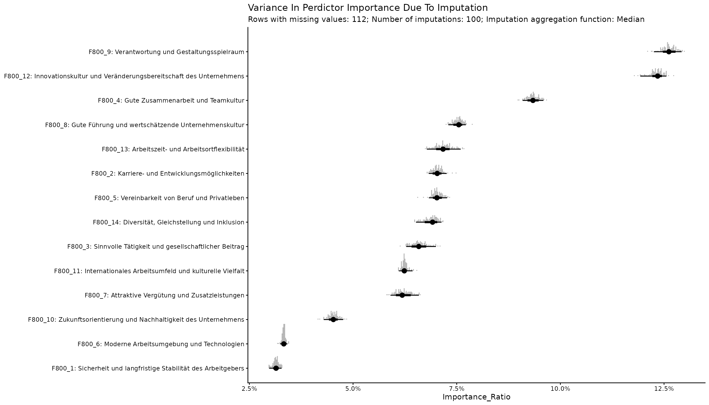

``` r

res_imp$plots$diagnostics_performance
```

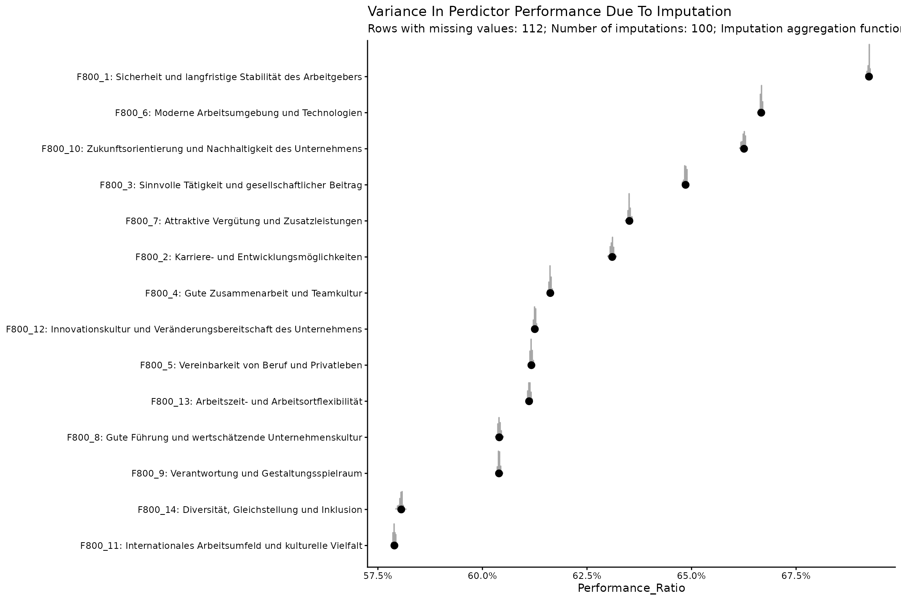

------------------------------------------------------------------------

## Extended Discussion of Importance Methods

### Dominance Analysis

#### Practical relevance

In many applied regression settings—particularly with observational
data—predictors are **correlated**, making it unclear how much each
predictor truly contributes to the model. Standard regression outputs
(e.g., standardized coefficients, partial $`R^2`$ , or $`t`$-statistics)
depend on the specific set of covariates included and can change
dramatically under multicollinearity. As a result, they often provide
**unstable or misleading assessments of predictor importance**.

Dominance analysis addresses this problem by evaluating predictor
importance **across all possible regression models**, rather than
conditioning on a single model specification. By averaging each
predictor’s contribution to explained variance across all relevant
contexts, dominance analysis provides an importance measure that fully
reflects **both unique and shared effects** among correlated predictors.
This makes it especially useful when the goal is to **interpret relative
contributions** rather than to select a parsimonious prediction model.

In practice, dominance analysis is often viewed as a **reference or
gold‑standard** method for relative importance, against which more
computationally efficient approaches can be compared.

#### Methodology

Dominance analysis defines the importance of a predictor as its
**average marginal contribution to $`R^2`$** across all subset models in
which it appears.

Formally, for each predictor $`X_j`$:

1.  All possible subsets of the remaining predictors are considered.
2.  For each subset $`S`$, the increase in explained variance,
    ``` math
    \Delta R^2 = R^2(S \cup {X_j}) - R^2(S)
    ```
    is computed.
3.  These incremental contributions are **averaged over all subsets**,
    yielding a non‑negative importance value for $`X_j`$.

The resulting dominance statistics **sum exactly to the total model
$`R^2`$** and can be expressed as percentages of explained variance.
Dominance analysis is mathematically equivalent to the **LMG / Shapley
value decomposition** of $`R^2`$, ensuring a fair and order‑independent
allocation of shared variance. Its principal drawback is computational
complexity, as the number of subset models grows exponentially with the
number of predictors.

### Johnson’s Relative Weights (JRW)

#### Practical relevance

Relative weights analysis was developed to solve the **same
interpretational problem as dominance analysis**—namely, how to allocate
explained variance among **correlated predictors**—but in a way that is
**computationally feasible for larger models**. In real data, predictors
frequently measure overlapping constructs, and treating them as if they
compete for variance (as regression coefficients do) can exaggerate
differences or produce suppressor effects that are difficult to
interpret.

Johnson’s relative weights redistribute explained variance so that
predictors which are conceptually similar and similarly related to the
outcome receive **similar importance estimates**, even when strongly
correlated. This aligns well with how applied researchers and
stakeholders typically think about importance (e.g., “Which inputs
matter most overall?”).

As such, relative weights are particularly useful when: - predictors are
moderately to highly intercorrelated, - the focus is on **explaining
variance**, not selecting variables, and - clear, stable importance
estimates are needed for communication or reporting.

#### Methodology

Johnson’s relative weights method estimates each predictor’s
contribution to $`R^2`$ by combining orthogonalization with variance
reallocation.

The procedure can be summarized in four steps:

1.  **Orthogonalization of predictors**  
    The correlated predictors are transformed into a set of
    **uncorrelated variables** using a least‑squares orthogonalization
    based on the eigenvalue decomposition of the predictors’ correlation
    matrix. This transformation yields orthogonal variables that are
    maximally similar to the original predictors.

2.  **Regression on orthogonal variables**  
    The outcome is regressed on the orthogonal predictors. Because these
    predictors are uncorrelated, each squared standardized coefficient
    represents the portion of $`R^2`$ attributable to that orthogonal
    component.

3.  **Mapping variance back to original predictors**  
    Each orthogonal variable is expressed as a linear combination of the
    original predictors. The variance explained by each orthogonal
    component is then **partitioned among the original predictors**
    according to their squared correlations with that component.

4.  **Computation of relative weights**  
    A predictor’s relative weight is obtained by summing its allocated
    contributions across all orthogonal components. The resulting
    weights are **non‑negative and sum exactly to $`R^2`$**, and are
    typically reported as percentages of explained variance.

Empirically, Johnson showed that these relative weights closely
approximate dominance analysis results, especially for moderate
correlations, while requiring far less computation.

#### Summary comparison

Both dominance analysis and Johnson’s relative weights address the
interpretational ambiguity caused by correlated predictors: dominance
analysis does so exactly by averaging contributions across all subset
models, whereas Johnson’s relative weights provide a computationally
efficient approximation that yields very similar and practically
interpretable results.
