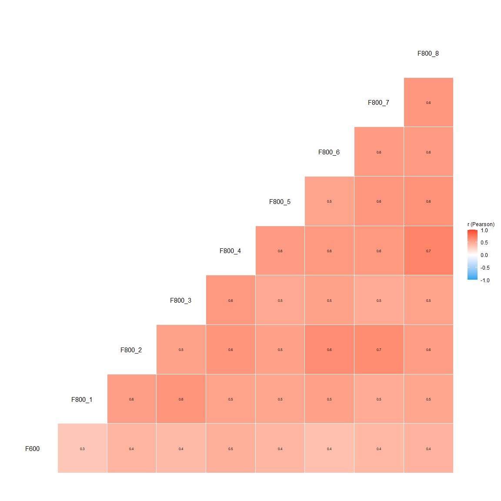

# YouAnalyser

The goal of YouAnalyser is to provide Analytics Partners of YouGov DACH
with a convenient and standardized way to perform core analyses on
survey data, such as Key Driver Analysis (KDA). The package includes
functions for data preprocessing, exploratory data analysis (EDA), and
KDA (more to come), all designed to work seamlessly with survey data in
the
[`haven::labelled()`](https://haven.tidyverse.org/reference/labelled.html)
format. By using YouAnalyser, you can save time and ensure consistency
in your analyses across different projects.

## Installation and Setup

You can install the development version of YouAnalyser from
[GitHub](https://github.com/) with:

``` r

# install.packages("pak")
pak::pak("EGuizarRosales/YouAnalyser")
```

Then, in your scripts, use:

``` r

library(YouAnalyser)
#> 
#> ── Welcome to YouAnalyser! ─────────────────────────────────────────────────────
#> ✔ Package loaded successfully!
#> Type `?YouAnalyser` to see the documentation.
#> Visit the package's website for more information:
#> <https://eguizarrosales.github.io/YouAnalyser/>
library(haven)
```

**Some general Tips:**

- You can find the documentation for each function by calling
  `?function_name` in your R console (e.g.,
  [`?eda_summary`](https://eguizarrosales.github.io/YouAnalyser/reference/eda_summary.md)).
- This package is documented with vignettes. You can browse the
  available vignettes with `browseVignettes("YouAnalyser")` and open a
  specific vignette with
  `vignette("vignette_name", package = "YouAnalyser")`.
- The most convenient way to access the full documentation of this
  package is through the website:
  <https://eguizarrosales.github.io/YouAnalyser/>.

## 1. Data Processing, Convenience Functions, and Example Data

All data processing functions start with the prefix `dp_`, while
convenience functions start with the prefix `ya_`. For a detailed
walkthrough of the data processing functions, please refer to the
vignette included in the package (use
e.g. [`vignette("dp", package = "YouAnalyser")`](https://eguizarrosales.github.io/YouAnalyser/articles/dp.md)),
which provide step-by-step guides on how to use the various functions
for data processing and other convenient tasks.

`YouAnalyser` assumes that your data comes in the
[`haven::labelled()`](https://haven.tidyverse.org/reference/labelled.html)
format, which is common for survey data. The package includes functions
to help you process and prepare your data for analysis if your data is
not already in this format:

- [`dp_copy_codebook_template()`](https://eguizarrosales.github.io/YouAnalyser/reference/dp_copy_codebook_template.md):
  Copy a codebook template to a specified file path
- [`dp_convert_to_labelled()`](https://eguizarrosales.github.io/YouAnalyser/reference/dp_convert_to_labelled.md):
  Convert a data frame to a labelled data frame using a codebook.
- [`dp_label_automatically()`](https://eguizarrosales.github.io/YouAnalyser/reference/dp_label_automatically.md):
  Automatically label a data frame based on its values (useful for
  filling in missing labels if you do not want to use
  [`dp_convert_to_labelled()`](https://eguizarrosales.github.io/YouAnalyser/reference/dp_convert_to_labelled.md)
  with a codebook - use with caution!)
- [`dp_inspect_codebook()`](https://eguizarrosales.github.io/YouAnalyser/reference/dp_inspect_codebook.md):
  Inspect the codebook of a labelled data frame (useful to check whether
  labelling worked as expected)
- `dp_zap_missings()`: Remove missing values and their value labels from
  a labelled data frame.

The convenience functions starting with `ya_` mostly take care of
selecting files, defining file names, and saving plots:

- [`ya_choose_file()`](https://eguizarrosales.github.io/YouAnalyser/reference/ya_choose_file.md):
  Choose an existing file and return its path
- [`ya_choose_file_path()`](https://eguizarrosales.github.io/YouAnalyser/reference/ya_choose_file_path.md):
  Choose an existing directory and define a new file in this directory,
  returning the full file path
- [`ya_save_plot()`](https://eguizarrosales.github.io/YouAnalyser/reference/ya_save_plot.md):
  Save a plot to JPEG

Special consideration should be given to
[`ya_setup_folder_structure()`](https://eguizarrosales.github.io/YouAnalyser/reference/ya_setup_folder_structure.md),
which creates a standardized folder structure for your project. This
function is designed to help you organize your files and outputs in a
consistent way across different projects. By default, it creates the
following folder structure:

``` r
├── 01_input
│   └── data
│       ├── processed
│       └── raw
├── 02_scripts
├── 03_output
│   ├── data
│   ├── plots
│   └── reports
├── Project2.Rproj
└── R
```

The
[`ya_setup_folder_structure()`](https://eguizarrosales.github.io/YouAnalyser/reference/ya_setup_folder_structure.md)
function is used in workflows. See
[`vignette("kda", package = "YouAnalyser")`](https://eguizarrosales.github.io/YouAnalyser/articles/kda.md)
for an example of how to use it in a workflow.

## 2. Exploratory Data Analysis (EDA)

All EDA functions start with the prefix `eda_`. For a detailed
walkthrough of the EDA functions, please refer to the vignettes included
in the package (use
e.g. [`vignette("eda", package = "YouAnalyser")`](https://eguizarrosales.github.io/YouAnalyser/articles/eda.md)),
which provide step-by-step guides on how to use the various functions
for EDA.

There are two basic functions for EDA in the YouAnalyser package:
[`eda_summary()`](https://eguizarrosales.github.io/YouAnalyser/reference/eda_summary.md)
and
[`eda_correlation()`](https://eguizarrosales.github.io/YouAnalyser/reference/eda_correlation.md).
The former provides a summary of the data, including descriptive
statistics and missing values, while the latter calculates and
visualizes correlations between variables.

``` r

eda_summary(
  data = bkw_processed,
  variables = c("F600", paste0("F800_", 1:8)),
  console_output = TRUE,
  browser_output = FALSE
)
#> 
#> ── Data Frame Summary
#> Data Frame Summary  
#> data  
#> Dimensions: 1104 x 9  
#> Duplicates: 231  
#> 
#> ---------------------------------------------------------------------------------------------------------------------------------------------------
#> Variable           Label                                      Stats / Values                 Freqs (% of Valid)   Graph        Valid      Missing  
#> ------------------ ------------------------------------------ ------------------------------ -------------------- ------------ ---------- ---------
#> F600               Wie attraktiv finden Sie die BKW als       1. [1] 1 - Überhaupt nicht a    42 ( 3.8%)                       1104       0        
#> [haven_labelled,   Arbeitgeberin?                             2. [2] 2                        49 ( 4.4%)                       (100.0%)   (0.0%)   
#> vctrs_vctr,                                                   3. [3] 3                       127 (11.5%)          II                               
#> double]                                                       4. [4] 4                       443 (40.1%)          IIIIIIII                         
#>                                                               5. [5] 5                       282 (25.5%)          IIIII                            
#>                                                               6. [6] 6                       100 ( 9.1%)          I                                
#>                                                               7. [7] 7 - Sehr attraktiv       61 ( 5.5%)          I                                
#> 
#> F800_1             Sicherheit und langfristige Stabilität     1. [1] Überhaupt nicht gut      11 ( 1.0%)                       1104       0        
#> [haven_labelled,   des Arbeitgebers                           2. [2] 2                        21 ( 1.9%)                       (100.0%)   (0.0%)   
#> vctrs_vctr,                                                   3. [3] 3                        65 ( 5.9%)          I                                
#> double]                                                       4. [4] 4                       295 (26.7%)          IIIII                            
#>                                                               5. [5] 5                       256 (23.2%)          IIII                             
#>                                                               6. [6] 6                       300 (27.2%)          IIIII                            
#>                                                               7. [7] Sehr gut  7             156 (14.1%)          II                               
#> 
#> F800_2             Karriere- und Entwicklungsmöglichkeiten    1. [1] Überhaupt nicht gut      11 ( 1.0%)                       1104       0        
#> [haven_labelled,                                              2. [2] 2                        33 ( 3.0%)                       (100.0%)   (0.0%)   
#> vctrs_vctr,                                                   3. [3] 3                        69 ( 6.2%)          I                                
#> double]                                                       4. [4] 4                       405 (36.7%)          IIIIIII                          
#>                                                               5. [5] 5                       300 (27.2%)          IIIII                            
#>                                                               6. [6] 6                       209 (18.9%)          III                              
#>                                                               7. [7] Sehr gut  7              77 ( 7.0%)          I                                
#> 
#> F800_3             Sinnvolle Tätigkeit und                    1. [1] Überhaupt nicht gut      12 ( 1.1%)                       1104       0        
#> [haven_labelled,   gesellschaftlicher Beitrag                 2. [2] 2                        27 ( 2.4%)                       (100.0%)   (0.0%)   
#> vctrs_vctr,                                                   3. [3] 3                        87 ( 7.9%)          I                                
#> double]                                                       4. [4] 4                       348 (31.5%)          IIIIII                           
#>                                                               5. [5] 5                       289 (26.2%)          IIIII                            
#>                                                               6. [6] 6                       238 (21.6%)          IIII                             
#>                                                               7. [7] Sehr gut  7             103 ( 9.3%)          I                                
#> 
#> F800_4             Gute Zusammenarbeit und Teamkultur         1. [1] Überhaupt nicht gut      13 ( 1.2%)                       1104       0        
#> [haven_labelled,                                              2. [2] 2                        20 ( 1.8%)                       (100.0%)   (0.0%)   
#> vctrs_vctr,                                                   3. [3] 3                        81 ( 7.3%)          I                                
#> double]                                                       4. [4] 4                       447 (40.5%)          IIIIIIII                         
#>                                                               5. [5] 5                       300 (27.2%)          IIIII                            
#>                                                               6. [6] 6                       182 (16.5%)          III                              
#>                                                               7. [7] Sehr gut  7              61 ( 5.5%)          I                                
#> 
#> F800_5             Vereinbarkeit von Beruf und Privatleben    1. [1] Überhaupt nicht gut      14 ( 1.3%)                       1104       0        
#> [haven_labelled,                                              2. [2] 2                        27 ( 2.4%)                       (100.0%)   (0.0%)   
#> vctrs_vctr,                                                   3. [3] 3                       102 ( 9.2%)          I                                
#> double]                                                       4. [4] 4                       435 (39.4%)          IIIIIII                          
#>                                                               5. [5] 5                       286 (25.9%)          IIIII                            
#>                                                               6. [6] 6                       157 (14.2%)          II                               
#>                                                               7. [7] Sehr gut  7              83 ( 7.5%)          I                                
#> 
#> F800_6             Moderne Arbeitsumgebung und Technologien   1. [1] Überhaupt nicht gut      14 ( 1.3%)                       1104       0        
#> [haven_labelled,                                              2. [2] 2                        26 ( 2.4%)                       (100.0%)   (0.0%)   
#> vctrs_vctr,                                                   3. [3] 3                        66 ( 6.0%)          I                                
#> double]                                                       4. [4] 4                       315 (28.5%)          IIIII                            
#>                                                               5. [5] 5                       311 (28.2%)          IIIII                            
#>                                                               6. [6] 6                       254 (23.0%)          IIII                             
#>                                                               7. [7] Sehr gut  7             118 (10.7%)          II                               
#> 
#> F800_7             Attraktive Vergütung und                   1. [1] Überhaupt nicht gut      12 ( 1.1%)                       1104       0        
#> [haven_labelled,   Zusatzleistungen                           2. [2] 2                        17 ( 1.5%)                       (100.0%)   (0.0%)   
#> vctrs_vctr,                                                   3. [3] 3                        81 ( 7.3%)          I                                
#> double]                                                       4. [4] 4                       430 (38.9%)          IIIIIII                          
#>                                                               5. [5] 5                       260 (23.6%)          IIII                             
#>                                                               6. [6] 6                       211 (19.1%)          III                              
#>                                                               7. [7] Sehr gut  7              93 ( 8.4%)          I                                
#> 
#> F800_8             Gute Führung und wertschätzende            1. [1] Überhaupt nicht gut      16 ( 1.4%)                       1104       0        
#> [haven_labelled,   Unternehmenskultur                         2. [2] 2                        30 ( 2.7%)                       (100.0%)   (0.0%)   
#> vctrs_vctr,                                                   3. [3] 3                        97 ( 8.8%)          I                                
#> double]                                                       4. [4] 4                       454 (41.1%)          IIIIIIII                         
#>                                                               5. [5] 5                       276 (25.0%)          IIIII                            
#>                                                               6. [6] 6                       163 (14.8%)          II                               
#>                                                               7. [7] Sehr gut  7              68 ( 6.2%)          I                                
#> ---------------------------------------------------------------------------------------------------------------------------------------------------
#> 
#> ── Descriptive Statistics
#> Variable | Mean |   SD |        Range |  Quartiles | Skewness | Kurtosis |    n | n_Missing
#> -------------------------------------------------------------------------------------------
#> F600     | 4.28 | 1.29 | [1.00, 7.00] | 4.00, 5.00 |    -0.22 |     0.53 | 1104 |         0
#> F800_1   | 5.07 | 1.29 | [1.00, 7.00] | 4.00, 6.00 |    -0.40 |    -0.10 | 1104 |         0
#> F800_2   | 4.71 | 1.20 | [1.00, 7.00] | 4.00, 6.00 |    -0.17 |     0.23 | 1104 |         0
#> F800_3   | 4.81 | 1.26 | [1.00, 7.00] | 4.00, 6.00 |    -0.22 |    -0.03 | 1104 |         0
#> F800_4   | 4.62 | 1.14 | [1.00, 7.00] | 4.00, 5.00 |    -0.07 |     0.49 | 1104 |         0
#> F800_5   | 4.59 | 1.21 | [1.00, 7.00] | 4.00, 5.00 | 3.59e-03 |     0.26 | 1104 |         0
#> F800_6   | 4.92 | 1.26 | [1.00, 7.00] | 4.00, 6.00 |    -0.37 |     0.18 | 1104 |         0
#> F800_7   | 4.73 | 1.21 | [1.00, 7.00] | 4.00, 6.00 |    -0.02 |     0.07 | 1104 |         0
#> F800_8   | 4.54 | 1.19 | [1.00, 7.00] | 4.00, 5.00 |    -0.05 |     0.39 | 1104 |         0
```

By setting `browser_output = TRUE`, the output will be displayed in your
default web browser, which can be more convenient for exploring large
tables and visualizations. The result will look like this:


Summary Table as a Browser Output

You can request a correlation matrix for a set of variables using the
[`eda_correlation()`](https://eguizarrosales.github.io/YouAnalyser/reference/eda_correlation.md)
function:

``` r

eda_corrs <- eda_correlation(
  data = bkw_processed,
  variables = c("F600", paste0("F800_", 1:8)),
  correlation_type = "Pearson"
)
print(eda_corrs$d)
#> # Correlation Matrix (Pearson-method)
#> 
#> Parameter1 | Parameter2 |    r |       95% CI | t(1102) |         p
#> -------------------------------------------------------------------
#> F600       |     F800_1 | 0.33 | [0.27, 0.38] |   11.45 | < .001***
#> F600       |     F800_2 | 0.43 | [0.38, 0.48] |   15.78 | < .001***
#> F600       |     F800_3 | 0.40 | [0.35, 0.45] |   14.52 | < .001***
#> F600       |     F800_4 | 0.46 | [0.41, 0.50] |   17.13 | < .001***
#> F600       |     F800_5 | 0.42 | [0.37, 0.47] |   15.56 | < .001***
#> F600       |     F800_6 | 0.36 | [0.31, 0.41] |   13.00 | < .001***
#> F600       |     F800_7 | 0.41 | [0.36, 0.46] |   15.05 | < .001***
#> F600       |     F800_8 | 0.44 | [0.39, 0.49] |   16.29 | < .001***
#> F800_1     |     F800_2 | 0.56 | [0.51, 0.59] |   22.17 | < .001***
#> F800_1     |     F800_3 | 0.60 | [0.56, 0.64] |   25.09 | < .001***
#> F800_1     |     F800_4 | 0.53 | [0.49, 0.57] |   20.80 | < .001***
#> F800_1     |     F800_5 | 0.51 | [0.47, 0.55] |   19.76 | < .001***
#> F800_1     |     F800_6 | 0.54 | [0.50, 0.58] |   21.41 | < .001***
#> F800_1     |     F800_7 | 0.48 | [0.44, 0.53] |   18.40 | < .001***
#> F800_1     |     F800_8 | 0.52 | [0.47, 0.56] |   19.96 | < .001***
#> F800_2     |     F800_3 | 0.54 | [0.49, 0.58] |   21.18 | < .001***
#> F800_2     |     F800_4 | 0.60 | [0.56, 0.64] |   24.98 | < .001***
#> F800_2     |     F800_5 | 0.54 | [0.50, 0.58] |   21.27 | < .001***
#> F800_2     |     F800_6 | 0.65 | [0.61, 0.68] |   28.26 | < .001***
#> F800_2     |     F800_7 | 0.65 | [0.61, 0.68] |   28.42 | < .001***
#> F800_2     |     F800_8 | 0.56 | [0.52, 0.60] |   22.35 | < .001***
#> F800_3     |     F800_4 | 0.59 | [0.55, 0.62] |   24.03 | < .001***
#> F800_3     |     F800_5 | 0.50 | [0.45, 0.54] |   19.07 | < .001***
#> F800_3     |     F800_6 | 0.53 | [0.49, 0.58] |   21.00 | < .001***
#> F800_3     |     F800_7 | 0.48 | [0.44, 0.53] |   18.33 | < .001***
#> F800_3     |     F800_8 | 0.53 | [0.49, 0.57] |   20.72 | < .001***
#> F800_4     |     F800_5 | 0.57 | [0.53, 0.61] |   23.30 | < .001***
#> F800_4     |     F800_6 | 0.59 | [0.55, 0.62] |   23.97 | < .001***
#> F800_4     |     F800_7 | 0.58 | [0.54, 0.62] |   23.77 | < .001***
#> F800_4     |     F800_8 | 0.70 | [0.67, 0.73] |   32.47 | < .001***
#> F800_5     |     F800_6 | 0.53 | [0.48, 0.57] |   20.58 | < .001***
#> F800_5     |     F800_7 | 0.60 | [0.56, 0.64] |   24.91 | < .001***
#> F800_5     |     F800_8 | 0.62 | [0.58, 0.65] |   25.92 | < .001***
#> F800_6     |     F800_7 | 0.57 | [0.53, 0.61] |   23.33 | < .001***
#> F800_6     |     F800_8 | 0.57 | [0.53, 0.61] |   23.32 | < .001***
#> F800_7     |     F800_8 | 0.60 | [0.56, 0.63] |   24.65 | < .001***
#> 
#> p-value adjustment method: Holm (1979)
#> Observations: 1104
print(eda_corrs$p)
```



There are many more options for `correlation_type`. To see all available
options, call
[`?correlation::correlation`](https://easystats.github.io/correlation/reference/correlation.html)
and read the details section.

## 3. Key Driver Analysis (KDA)

All KDA functions start with the prefix `kda_`. For a detailed
walkthrough of the KDA functions, please refer to the vignettes included
in the package (use
e.g. [`vignette("kda", package = "YouAnalyser")`](https://eguizarrosales.github.io/YouAnalyser/articles/kda.md)),
which provide step-by-step guides on how to use the various functions
for KDA.

This is a basic example which shows you how to conduct a End-2-End Key
Driver Analysis using the YouAnalyser package. For a more detailed
walkthrough, please refer to the vignettes included in the package (use
e.g. [`vignette("kda", package = "YouAnalyser")`](https://eguizarrosales.github.io/YouAnalyser/articles/kda.md)),
which provide step-by-step guides on how to use the various functions
for KDA.

``` r

res <- kda_regression(
  data = bkw_processed,
  outcome = "F600",
  predictors = paste0("F800_", 1:8),
  diagnostics = TRUE,
  importance_method = "auto"
)
```

`res` is a list containing the results of the KDA, including the fitted
regression model, variable importance and performance measures, and
plots. The most important outcome is the “Importance Performance Map
Analysis” (IPMA) plot, which can be accessed like this:

``` r

res$plots$ipma_scatterPlot$p
```

Below you can find all the available plots in the `res` object. You can
save these plots using the
[`ya_save_plot()`](https://eguizarrosales.github.io/YouAnalyser/reference/ya_save_plot.md)
function, which allows you to specify the file path and dimensions of
the saved plot.

`res$plots$diagnostics_correlation`


`res$plots$diagnostics_model`


`res$plots$model_forestPlot$p`


`res$plots$importance_barPlot$p`


`res$plots$performance_barPlot$p`


`res$plots$ipma_scatterPlot$p`


