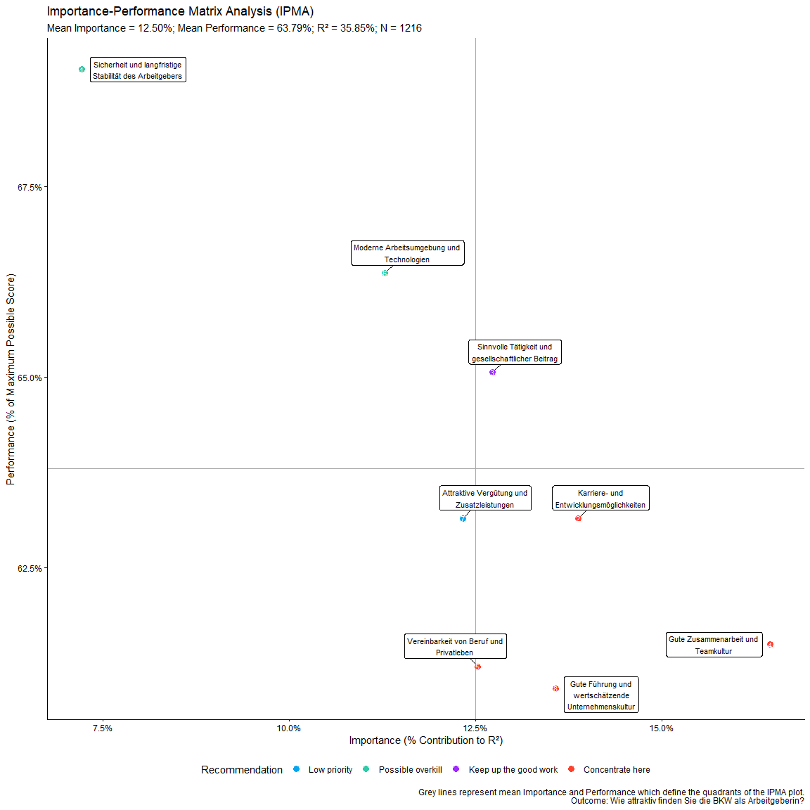

# YouAnalyser

The goal of YouAnalyser is to provide Analytics Partners of YouGov DACH
with a convenient and standardized way to perform core analyses on
survey data, such as Key Driver Analysis (KDA). The package includes
functions for data preprocessing, exploratory data analysis (EDA), and
KDA (more to come), all designed to work seamlessly with survey data in
the
[`haven::labelled()`](https://haven.tidyverse.org/reference/labelled.html)
format. By using YouAnalyser, you can save time and ensure consistency
in your analyses across different projects.

## Installation

You can install the development version of YouAnalyser from
[GitHub](https://github.com/) with:

``` r
# install.packages("pak")
pak::pak("EGuizarRosales/YouAnalyser")
```

## Example

This is a basic example which shows you how to conduct a End-2-End Key
Driver Analysis using the `YouAnalyser` package. For a more detailed
walkthrough, please refer to the vignettes included in the package,
which provide step-by-step guides on how to use the various functions
for KDA:

``` r
library(YouAnalyser)
library(haven)

res <- kda_regression(
  data = bkw_processed,
  outcome = "F600",
  predictors = paste0("F800_", 1:8),
  diagnostics = TRUE,
  importance_method = "auto"
)
#> Warning: '.cpt' and '.cdl' are depreciated arguments to 'domir' as of version 1.3.
#> Use '.cdl' and '.cpt' as arguments to 'print()' instead.
```

`res` is a list containing the results of the KDA, including the fitted
regression model, variable importance and performance measures, and
plots. The most important outcome is the “Importance Performance Map
Analysis” (IPMA) plot, which can be accessed like this:

``` r
res$plots$ipma_scatterPlot$p
```



The data visualized in this plot can be accessed like this:

``` r
res$plots$ipma_scatterPlot$d
#> # A tibble: 8 × 13
#>   predictor Importance_Raw Importance_Ratio Importance_Percent Importance_Rank
#>   <chr>              <dbl>            <dbl>              <dbl>           <dbl>
#> 1 F800_1            0.0259           0.0722               7.22               8
#> 2 F800_2            0.0498           0.139               13.9                2
#> 3 F800_3            0.0456           0.127               12.7                4
#> 4 F800_4            0.0590           0.165               16.5                1
#> 5 F800_5            0.0449           0.125               12.5                5
#> 6 F800_6            0.0405           0.113               11.3                7
#> 7 F800_7            0.0442           0.123               12.3                6
#> 8 F800_8            0.0487           0.136               13.6                3
#> # ℹ 8 more variables: Performance_Raw <dbl>, Performance_Ratio <dbl>,
#> #   Performance_Percent <dbl>, Performance_Rank <int>, recommendation <fct>,
#> #   predictor_nr <int>, label <chr>, label_withPred <chr>
```
