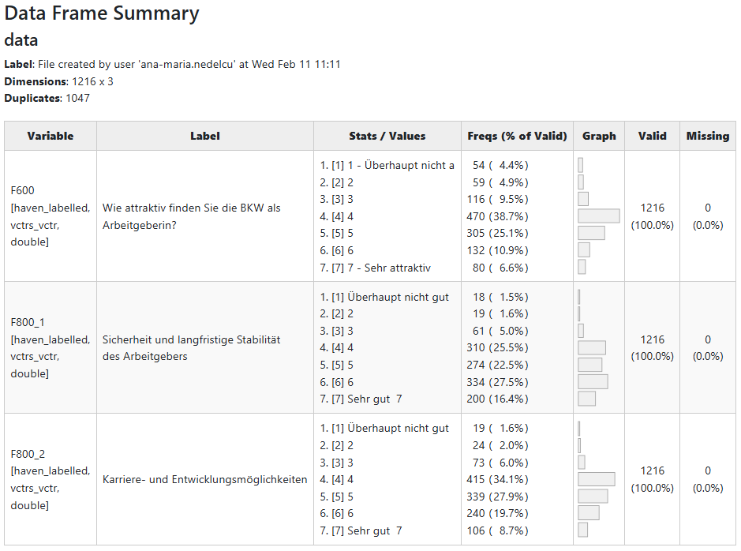

```{r, include = FALSE}
knitr::opts_chunk$set(
  collapse = TRUE,
  comment = "#>"
)
```

```{r setup}
library(YouAnalyser)
library(haven)
```

## 1. Overview and Descriptive Statistics

The `eda_summary()` function provides a comprehensive overview of your data:

- It generates a data frame summary that displays for each variable the variable label, value labels, frquencies by values, a histogram, number of valid values and number of missing values.
- It also computes descriptive statistics for each variable: Mean, Standard Deviation, Range, Quartiles, Skewness, and Kurtosis.

By default, `eda_summary()` opens a browser window to display the summary table and prints the descriptive statistics in the console. You can control this behavior with the `console_output` and `browser_output` arguments. 

```{r eda_summary_example}
# Provide summary in console only:
eda_summary(
  data = bkw_processed,
  variables = c("F600", "F800_1", "F800_2"), # If NULL (default), all variables are included
  console_output = TRUE,
  browser_output = FALSE
)
```

If `browser_output` is set to `TRUE`, the summary table looks like this:



## 2. Variable Correlations

The `eda_correlations()` function computes and visualizes the correlation matrix for a set of variables. It supports different correlation methods (e.g., Pearson, Spearman) and provides a heatmap visualization of the correlations.

```{r eda_correlations_example, fig.width = 8, fig.height = 8, out.width = "100%"}
out <- eda_correlation(
  data = bkw_processed,
  variables = c("F600", paste0("F800_", 1:8)), # If NULL (default), all variables are included
  correlation_type = "pearson"
)

# Inspect pairwise correlations
out$d

# Display correlation heatmap
out$p
```

## 3. Going Further

If you need more sophisticated tools for EDA, I highly recommend the package `GGally`, especially the function `GGally::ggpairs()`, which allows you to create a matrix of scatterplots, histograms, and correlation coefficients for a set of variables. This can be particularly useful for visualizing relationships between variables in your survey data.

```{r ggpairs-example, fig.width = 12, fig.height = 8, out.width = "100%"}
# Create a dummy data set with a binary outcome variable coded as factor and three binary predictors
binary_data_example <- bkw_bin_outcome |>
  dplyr::select("F600", paste0("F800_", 1:3)) |>
  dplyr::mutate(F600 = haven::as_factor(F600))

# Visalize pairwise relationships with ggpairs.
GGally::ggpairs(
  data = binary_data_example,
  mapping = ggplot2::aes(color = F600)
) +
  ggplot2::scale_colour_manual(
    values = c("#ff412c", "#31caa8"),
  ) +
  ggplot2::scale_fill_manual(
    values = c("#ff412c", "#31caa8"),
  ) +
  ggplot2::theme_bw()
```

If you are using [Positron](https://positron.posit.co/) as your IDE -- which I cannot stress enough how much I recommend -- you can also use the built-in [Data Explorer](https://positron.posit.co/data-explorer.html), which provides a user-friendly interface for exploring your data, including summary statistics, visualizations, and the ability to filter and subset your data. Finally, also give the amazing [Databot](https://positron.posit.co/databot.html) a try! It is an AI assistant that can help you with data analysis tasks, including EDA, and can be a great companion for your data analysis workflow.