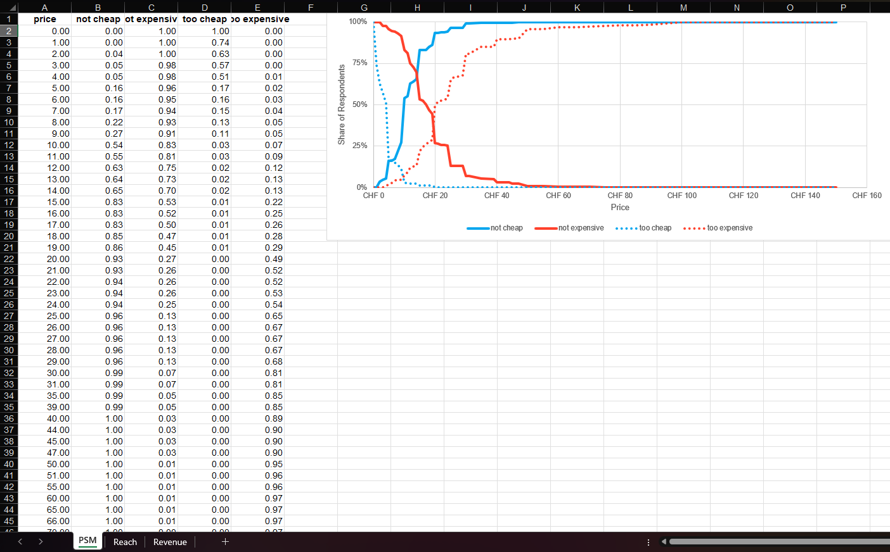
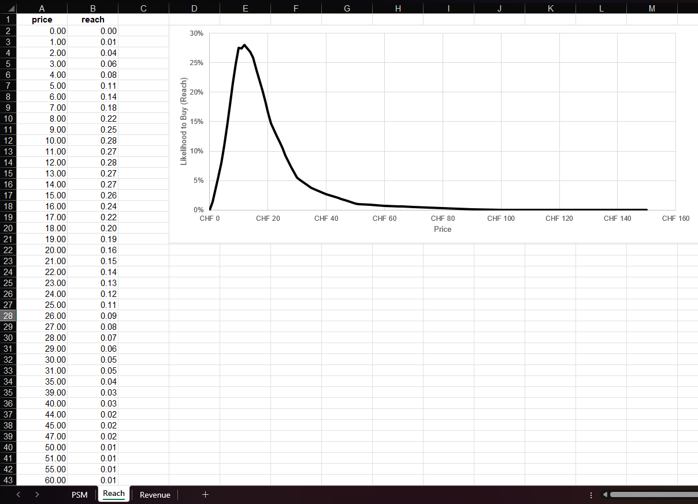

```{r, include = FALSE}
knitr::opts_chunk$set(
  collapse = TRUE,
  comment = "#>"
)
```

```{r setup}
library(YouAnalyser)
library(haven)
```

# 1. Introduction

## 1.1 The Van Westendorp Price Sensitivity Meter

The Price Sensitivity Meter (PSM), developed by Peter van Westendorp, is a direct, survey-based technique for estimating the range of prices consumers find acceptable for a product or concept. Its main appeal is that it can be used **before a product exists in the market**, e.g. for a new product concept or a repositioning, when there is no historical sales or pricing data to rely on.

Each respondent is asked four open-ended price questions about the same product concept:

1. **Too cheap**: "At what price would you consider Product X to be priced so low that you would feel the quality couldn't be very good?"
2. **Cheap**: "At what price would you consider Product X to be a bargain - a great buy for the money?"
3. **Expensive**: "At what price would you consider Product X starting to get expensive, so that it is not out of the question, but you would have to give some thought to buying it?"
4. **Too expensive**: "At what price would you consider Product X to be so expensive that you would not consider buying it?"

Plotting the cumulative distribution of each of these four answers against price yields four curves whose intersections are used to derive the key PSM reference points:

- **IDP (Indifference Price Point)**: intersection of "not cheap" and "not expensive" - the price at which equal shares of respondents see the product as not cheap versus not expensive. This can be interpreted as the price the market "expects" for the product.
- **OPP (Optimal Price Point)**: intersection of "too cheap" and "too expensive" - the price that minimizes the share of respondents rejecting the product either on quality-suspicion (too cheap) or cost (too expensive) grounds.
- **Acceptable price range**: bounded below by the intersection of "not cheap" and "too cheap", and above by the intersection of "not expensive" and "too expensive".

PSM is a good fit whenever you need a quick, inexpensive read on acceptable pricing bounds early in product development. Its main limitation follows directly from what it measures: it only bounds *acceptability*, and says nothing about how many people would actually buy at a given price, or what that implies for revenue.

## 1.2 The Newton-Miller-Smith (NMS) Extension

The Newton-Miller-Smith (NMS) extension closes this gap by adding two purchase-intent questions, each piping in the respondent's own answer from the basic PSM questions:

- "How likely are you to purchase Product X at **[piped: price given as _cheap_]**?" (1: extremely unlikely - 5: extremely likely)
- "How likely are you to purchase Product X at **[piped: price given as _expensive_]**?" (1: extremely unlikely - 5: extremely likely)

This lets you move from a plausible price *range* (PSM) to concrete price *recommendations*: the price that maximizes reach (market penetration) and the price that maximizes revenue, which are often not the same price. Use the NMS extension whenever you can afford the two additional questions and need this kind of actionable pricing guidance rather than just an acceptable range.

### How reach and revenue are calculated

For each respondent, `psm_analysis()` builds a personal purchase-probability curve across the full price range, anchored at the four prices that respondent gave in the basic PSM questions:

| Anchor price (from the PSM questions) | Assigned purchase probability |
|---|---|
| too cheap | 0 (fixed calibration constant) |
| cheap | calibrated value derived from that respondent's stated purchase intent at the _cheap_ price |
| expensive | calibrated value derived from that respondent's stated purchase intent at the _expensive_ price |
| too expensive | 0 (fixed calibration constant) |

The two purchase-intent answers (on the 1-5 "extremely unlikely" to "extremely likely" scale) are not used at face value, because stated purchase intent is well known to overstate real buying behaviour. Instead they are calibrated down using fixed constants (the package defaults are 5 &rarr; 0.7, 4 &rarr; 0.5, 3 &rarr; 0.3, 2 &rarr; 0.1, 1 &rarr; 0), so that even a respondent who answers "extremely likely" is only assumed to have a 70% real purchase probability at that price.

Between these four anchor points, each respondent's probability curve is filled in by linear interpolation (and held flat beyond the lowest/highest anchor). This gives every respondent an individual, continuous purchase-probability curve over price. From these individual curves, at every price point in the data:

- **`reach`** is the (weighted) average across respondents of their individual purchase probabilities at that price. Because it is an average of probabilities, `reach` in `psm_nms$data_nms` is expressed on a **0-1 scale** (equivalently, a percentage from 0% to 100%) - it estimates the *share* of the surveyed population expected to purchase at that price, not a headcount.
- **`revenue`** is simply `price * reach`. Since `reach` is a fraction rather than a count, `revenue` is best read as an **index of expected revenue per respondent**, not a real, absolute currency amount for the whole market. It is only meaningful in *relative* terms, i.e. for comparing across prices to find the revenue-maximizing price (`price_optimal_revenue`). To translate it into an actual expected revenue figure, multiply `revenue` by the size of your addressable market.

`price_optimal_reach` and `price_optimal_revenue` (also part of the `psm_analysis()` output) are simply the prices at which `reach` and `revenue`, respectively, are maximized across this table.

# 2. PSM Analysis in YouAnalyser

Note that the PSM implemented in YouAnalyser based on the well documented `?pricesensitivitymeter` package.

In the following, we will work with a synthetic data set. `tooCheap`, `cheap`, `tooExpensive`, and `expensive` are based on numeric input fields, in which hypothetical respondents answerd at which price they would consider a product as _too cheap, cheap, too expensive, and expensive_. The variables `purchaseIntentionCheap` and `purchaseIntentionExpensive` (only asked in the NMS-extension) indicate a 5-point rating scale asking how likely respondents are to purchase the product at the price they indicated as being _cheap_ and _expensive_, respectively (1 = "extremely unelikely", 5 = "extremely likely"). 

```{r exampleData}
chm_synthetic |> 
  dplyr::slice_head(n = 10) |> 
  knitr::kable()
```

## 2.1. Basic PSM

We can run a basic PSM analysis without the NMS-extension using the following command. Note that the function requires the data to be a simple data frame, which is why we enclose the haven-labeleld tibble in the respective function call: `as.data.frame(chm_synthetic)`. By setting `validate = TRUE`, we only consider participants with logically sound responses, i.e. their answers follow _too cheap_ < _cheap_ < _expensive_ < _too expensive_.

```{r simplePSM}
# Do the analysis
psm <- psm_analysis(
  data = as.data.frame(chm_synthetic),
  toocheap = "tooCheap",
  cheap = "cheap",
  expensive = "expensive",
  tooexpensive = "tooExpensive",
  validate = TRUE
)

# Get a summary of the results
summary(psm)
```

We can plot the results using the following code. `xlim` and `currency_prefix` are optional.

```{r simplePSM_plot, fig.width = 10, height = 8, out.width="100%"}
psm_plot(psm, xlim = c(0, 50), currency_prefix = "CHF ")$psm
```

## 2.2 Weighted PSM

If you want to run PSM on the full sample and have sample weights in your data that you would like to use for weighting, you can do the following. Note that we need to define a survey design object. If weights are provided in the dataset,
`psm_design_for_weighted()` can be used. If want to define your own survey design, you can do so by providing a custom `survey::svydesign()`-object to the `design` parameter.

```{r weightedPSM}
design <- psm_design_for_weighted(chm_synthetic, weight_var = "weight")
psm_weighted <- psm_analysis_weighted(
  design = design,
  toocheap = "tooCheap",
  cheap = "cheap",
  expensive = "expensive",
  tooexpensive = "tooExpensive",
  validate = TRUE
)

# Get a summary of the results
summary(psm_weighted)
```

## 2.3 PSM with NMS-Extension

If you have the right purchase intention questions in your questionnaire, you can use the NMS-extension. This only requires providing the questions in the arguments `pi_cheap` and `pi_expensive`. 

```{r PSM-NMS}
psm_nms <- psm_analysis(
  data = as.data.frame(chm_synthetic),
  toocheap = "tooCheap",
  cheap = "cheap",
  expensive = "expensive",
  tooexpensive = "tooExpensive",
  pi_cheap = "purchaseIntentionCheap",
  pi_expensive = "purchaseIntentionExpensive",
  validate = TRUE
)
```

Using the same `psm_plot()` function as be fore now in addition to the PSM plot also provides a plot showing the price that maximizes reach and a plot showing the price that maximizes revenue.

```{r PSM-NMS_plot, fig.width = 10, height = 8, out.width="100%"}
psm_plot(psm_nms, xlim = c(0, 50), currency_prefix = "CHF ")
```

# 3. Charts for PowerPoint Reporting

`YouAnalyser` includes functions to facilitate the creation of PSM charts for reporting in PowerPoint.

First, we need to save the data in an Excel file with the right structure for reporting. We can do this using the `psm_save_data_for_chart()` function, which takes the output of the `psm_analysis()` function and saves it to an Excel file. You can choose the file path interactively using the `ya_choose_file_path()` function.

```{r export-psm-data, eval = FALSE}
file_path <- ya_choose_file_path("psm_data.xlsx")
psm_save_data_for_chart(
  output_psm = psm_nms,
  file_path = file_path
)
```

This will result in a file that looks like this when opened in Excel. Note that if you ran PSM with NMS-Extension, the sheets _Reach_ and _Revenue_ will be populated with results too. Otherwise, only the first sheet _PSM_ will contain data.





This file has the right structure and contains all the information needed to update a pre-formatted PowerPoint template that you can use for reporting. You can copy the PowerPoint template to your desired location using the `psm_copy_pptx_template()` function:

```{r copy-pptx-template, eval = FALSE}
file_path <- ya_choose_file_path("psm_chart.pptx")
psm_copy_pptx_template(file_path)
```

Follow these steps to update the PowerPoint template with the exported data:

1. Open the psm data saved in the excel, i.e., `psm_data.xlsx` in this example.
2. In the sheet _PSM_, select the data, in this example **A1:E53**, and xopy it (Ctrl + C).
3. Open the PowerPoint template, i.e. `psm_chart.pptx` in this example.
4. Go to the slide with the PSM chart, right-click on the chart, and select "Edit Data" > "Edit Data in Excel". This will open the "Chart in Microsoft PowerPoint" window, which looks just like Excel.
5. In the "Chart in Microsoft PowerPoint" window, select the Cell **A1**, right-click, and paste values only (Ctrl + Shift + V). The chart in the PowerPoint will automatically update based on the pasted data. You can close the "Chart in Microsoft PowerPoint" window after pasting the data.
6. If you conducted PSM with NMS-Extension, repeat steps 2-5 for the sheets _Reach_ and _Revenue_.
7. Add points, arrows, lines etc. to your liking, e.g. for indicating the IDP, OPP and acceptable price range. Take inspiration by the plots generated by `psm_plot()`. 
